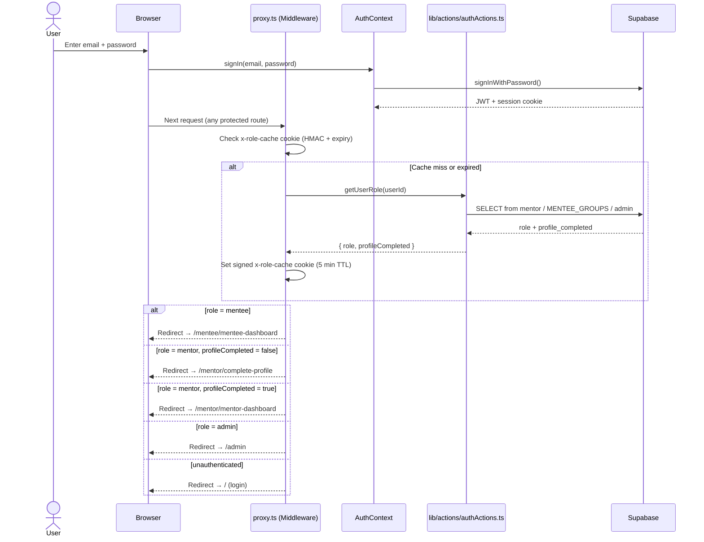
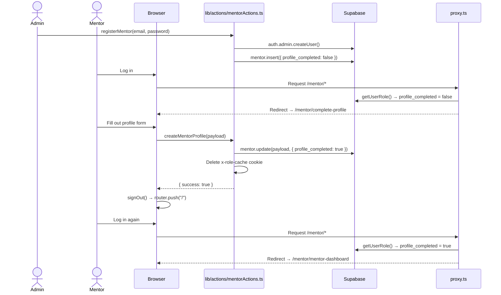
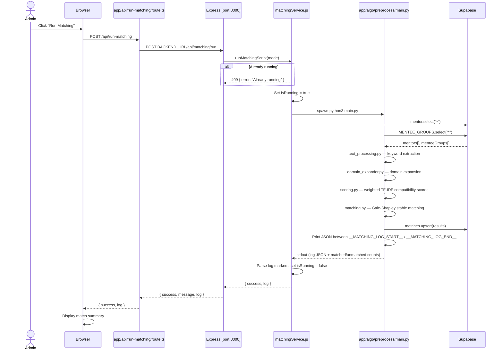
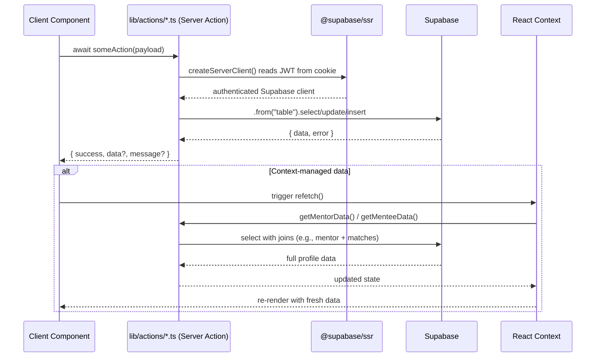

# CLAUDE.md

This file provides guidance to Claude Code (claude.ai/code) when working with code in this repository.

## Commands

```bash
# Development (both servers must run simultaneously)
npm run dev          # Next.js frontend on port 3000
npm run backend      # Express backend on port 8000 (required for matching algorithm)

# Build & production
npm run build
npm run start

# Linting & testing
npm run lint
npm test             # Run tests once (vitest)
npm run test:watch   # Watch mode
```

To run a single test file:
```bash
npx vitest run tests/unit/profile_validators.test.ts
```

## Architecture

This is a three-process application:

1. **Next.js frontend** (`/app`) — App Router, React 19, Tailwind CSS, Radix UI
2. **Express backend** (`/backend`) — Thin server on port 8000 that spawns the Python process
3. **Python matching engine** (`/app/algo/preprocess`) — Reads from Supabase, runs Gale-Shapley hospital-resident algorithm with TF-IDF cosine similarity scoring, writes results back to Supabase

The Next.js API route `/api/run-matching` proxies to the Express backend, which runs `python3 app/algo/preprocess/main.py` as a subprocess. The Python script signals completion with `__MATCHING_LOG_START__`/`__MATCHING_LOG_END__` markers in stdout.

## Sequence Diagrams

### 1. Auth & Role-Based Routing



### 2. Mentor Onboarding



### 3. Matching Pipeline



### 4. Server Actions Pattern (Client → Supabase)



## Data Layer

**Database:** Supabase (PostgreSQL). All DB access from Next.js is through server actions in `/lib/actions/`. There should be **no direct Supabase client calls from client components** — only from server actions and the Python script.

Key tables:
- `mentor` — mentor profiles (`profile_completed` flag gates onboarding redirect)
- `MENTEE_GROUPS` — mentee group profiles
- `matches` — results from the matching algorithm (`mentor_id`, `mentee_group_id`, `compatibility_score`, `matched_keywords`)
- `meetings` — recurring meeting schedules

**Local Supabase stack** is configured in `supabase/config.toml` (ports 54321–54323). Run via Supabase CLI if needed.

## Auth & Routing

Supabase Auth with JWTs stored in cookies via `@supabase/ssr`. The middleware (`proxy.ts`) enforces:
- Unauthenticated users → `/` (login)
- Role-based routing: `/mentee/*`, `/mentor/*`, `/admin/*`
- Mentors with `profile_completed=false` → `/mentor/complete-profile`

User role is determined by which table the user's auth ID appears in (`mentor`, `MENTEE_GROUPS`, or `admin`). To avoid a DB round-trip on every request, the resolved role + `profile_completed` are stored in a signed `x-role-cache` cookie with a 5-minute TTL. Creating a mentor profile deletes this cookie so the next request re-fetches.

## Code Conventions

- **Path alias:** `@/` maps to the repo root
- **Server actions** live in `/lib/actions/` and are the sole interface to Supabase from the Next.js layer
- **React Context** (`/app/context/`) manages auth, mentor, and mentee state — no Redux/Zustand
- **Rate limiting** (`/lib/rateLimit.ts`) is in-memory and resets on server restart; applies to login (5/5 min) and password reset (3/hr)
- UI components in `/components/ui/` wrap Radix UI primitives

## Testing

Tests live in `/tests/unit/` and use Vitest + React Testing Library with jsdom. Setup file: `tests/setup.ts`. Tests cover utility functions and validators, not database calls or full component trees.

## Python Matching Pipeline

Algorithm stages in `/app/algo/preprocess/`:
1. `text_processing.py` — keyword extraction and normalization
2. `domain_expander.py` — domain expansion
3. `scoring.py` — weighted compatibility scoring
4. `matching.py` — hospital-resident stable matching
5. `main.py` — orchestrator; reads from and writes to Supabase

The Python environment uses a venv; `HF_TOKEN` in `.env` is used for Hugging Face embeddings within scoring.
