# Mentor-Mentee Matching Algorithm — Flowchart

## Overview

The matching pipeline runs as a Python subprocess triggered by the admin dashboard. It performs keyword extraction, multi-pillar compatibility scoring, and a fair Hospital-Resident (Gale-Shapley) stable matching. Results are written back to Supabase.

---

## Full Pipeline Flowchart

```mermaid
flowchart TD
    A([Admin clicks\nRun Matching]) --> B[POST /api/run-matching\nNext.js API Route]
    B --> C[Express Backend\nport 8000]
    C -->|already running?| D{{409 — Already\nin progress}}
    C --> E[Spawn Python subprocess\nmain.py]

    %% ── PHASE 1: DATA ──────────────────────────────────────
    E --> F1

    subgraph PHASE1 ["Phase 1 · Data Collection & Preprocessing"]
        F1[Connect to Supabase\nvia service role key]
        F1 --> F2[Fetch all mentor profiles\nfrom mentor table]
        F1 --> F3[Fetch all mentee groups\nfrom MENTEE_GROUPS table]
        F2 & F3 --> F4[Normalize array fields\nJSON strings → Python lists]
        F4 --> F5{Any mentors\nor mentees missing?}
        F5 -->|Yes| F6([Exit — insufficient data])
        F5 -->|No| F7

        subgraph KEYWORD ["Keyword Extraction — per profile"]
            F7[Phase 1: Vocabulary scan\nMatch CS_TECH_VOCAB longest-first\ne.g. support vector machine before vector]
            F7 --> F8[Phase 2: TF-IDF residuals\nFill remaining slots from TF-IDF\nfiltered by ACADEMIC_STOP_WORDS]
            F8 --> F9[Pre-normalization\nc++ → cpp  node.js → nodejs\nscikit-learn → scikit learn  etc.]
        end
    end

    %% ── PHASE 2: SCORING ───────────────────────────────────
    F9 --> S1

    subgraph PHASE2 ["Phase 2 · Compatibility Scoring  —  5 Pillars"]
        S1[Build TF-IDF vectors\nfor all mentor & mentee texts]
        S1 --> S2[Cosine similarity\non keyword vectors]
        S2 --> S3[Domain expansion\nexpand_pair — broaden keyword overlap\nacross related CS subfields]
        S3 --> S4[Availability score\nOverlapping days × time slots]
        S3 --> S5[Experience score\nprev_mentored_thesis + certifications\n+ published_papers]
        S3 --> S6[Communication score\nInfer ONLINE / FACE_TO_FACE / FLEXIBLE\nfrom available_days]
        S3 --> S7[Meeting frequency score\nNo. overlapping days ÷ 3]
        S4 & S5 & S6 & S7 --> S8

        subgraph WEIGHTS ["Weighted Final Score"]
            S8["final = keyword×0.75\n+ experience×0.10\n+ availability×0.10\n+ communication×0.025\n+ meeting_freq×0.025"]
        end

        S8 --> S9[Score matrix\nmentees × mentors\nall pairwise scores]
    end

    %% ── PHASE 3: MATCHING ──────────────────────────────────
    S9 --> P1

    subgraph PHASE3 ["Phase 3 · Preference Lists + Hospital-Resident Matching"]
        P1[Generate preference lists\nEach mentee ranks all mentors by score\nEach mentor ranks all mentees by score]

        P1 --> HR1
        P1 --> HR2

        subgraph HR_MO ["HR — Mentee-Optimal  mentee-proposing"]
            HR1[Mentees propose to\ntheir top-ranked mentor]
            HR1 --> HR1b{Mentor has\nfree slot?}
            HR1b -->|Yes| HR1c[Tentatively accept]
            HR1b -->|No| HR1d{Is proposing mentee\nbetter ranked than\nworst current match?}
            HR1d -->|Yes| HR1e[Replace worst match\nRejected mentee re-proposes]
            HR1d -->|No| HR1f[Reject — mentee\nproposes next on list]
            HR1c & HR1e & HR1f --> HR1g{All mentees\nmatched or\nexhausted?}
            HR1g -->|No| HR1[loop]
            HR1g -->|Yes| HR1h[Mentee-optimal\nassignment A₁]
        end

        subgraph HR_MEO ["HR — Mentor-Optimal  mentor-proposing"]
            HR2[Mentors propose one slot\nat a time to top-ranked mentee]
            HR2 --> HR2b{Mentee holds\nan offer?}
            HR2b -->|No| HR2c[Mentee holds\nthis offer]
            HR2b -->|Yes| HR2d{Does mentee prefer\nnew mentor over\ncurrent held offer?}
            HR2d -->|Yes| HR2e[Switch to new offer\nRejected mentor re-proposes]
            HR2d -->|No| HR2f[Reject — mentor\nproposes next on list]
            HR2c & HR2e & HR2f --> HR2g{All mentor slots\nfilled or lists\nexhausted?}
            HR2g -->|No| HR2[loop]
            HR2g -->|Yes| HR2h[Mentor-optimal\nassignment A₂]
        end

        HR1h & HR2h --> FAIR

        subgraph FAIR ["Fairness Comparison"]
            FAIR1[Compute dissatisfaction\nfor A₁ — avg rank of matched partner\nfor both sides]
            FAIR2[Compute dissatisfaction\nfor A₂ — avg rank of matched partner\nfor both sides]
            FAIR1 & FAIR2 --> FAIR3{Which has lower\ncombined dissatisfaction\nmentee + mentor?}
            FAIR3 -->|A₁ lower or equal| FAIR4[Select mentee-optimal\nassignment]
            FAIR3 -->|A₂ lower| FAIR5[Select mentor-optimal\nassignment]
        end

        FAIR4 & FAIR5 --> STAB

        subgraph STAB ["Stability Verification"]
            STAB1[Check all mentee-mentor pairs\nnot in assignment]
            STAB1 --> STAB2{Does any pair\nboth prefer each other\nover current matches?}
            STAB2 -->|Yes — blocking pair| STAB3[Flag as UNSTABLE\nlog warning]
            STAB2 -->|No blocking pairs| STAB4[Confirm STABLE]
        end
    end

    %% ── PHASE 4: SAVE ──────────────────────────────────────
    STAB3 & STAB4 --> OUT1

    subgraph PHASE4 ["Phase 4 · Output & Persistence"]
        OUT1[Build match records\nmentee_group_id, mentor_id\ncompatibility_score, matched_keywords\nstatus, algorithm, is_stable]
        OUT1 --> OUT2[Clear existing matches\nfrom matches table]
        OUT2 --> OUT3[Insert new match records]
        OUT3 --> OUT4[Upsert preference lists\nto mentee_preferences\nand mentor_preferences tables]
        OUT4 --> OUT5[Insert structured JSON log\nto algorithm_logs table]
        OUT5 --> OUT6[Print JSON between\n__MATCHING_LOG_START__\n__MATCHING_LOG_END__ markers]
    end

    OUT6 --> RESULT[Express reads stdout\nParses JSON log]
    RESULT --> NEXT[Next.js API returns\nsummary to admin dashboard]
    NEXT --> DONE([Admin sees results:\nmatched count, algorithm\nstability, phase logs])
```

---

## Scoring Weights Reference

| Pillar | Weight | Signal |
|---|---|---|
| Keyword similarity | 75% | TF-IDF cosine similarity on research text |
| Experience | 10% | Mentor's previous theses, certifications, papers |
| Availability | 10% | Overlapping available days and time slots |
| Communication preference | 2.5% | ONLINE / FACE_TO_FACE / FLEXIBLE alignment |
| Meeting frequency | 2.5% | Number of overlapping available days (max 3) |

---

## Communication Mode Inference

| Available Days | Inferred Mode |
|---|---|
| Tuesday, Friday only | ONLINE |
| Monday, Wednesday, Thursday, Saturday only | FACE_TO_FACE |
| Mix of both sets, or unrecognized | FLEXIBLE |

FLEXIBLE is compatible with both ONLINE and FACE_TO_FACE partners.

---

## HR Algorithm — Why Two Variants?

| Property | Mentee-Optimal (A₁) | Mentor-Optimal (A₂) |
|---|---|---|
| Who proposes | Mentees | Mentors |
| Favors | Mentees get their top choices | Mentors get their top choices |
| Both are | Stable — no blocking pairs | Stable — no blocking pairs |

The **fair-matching** mode runs both, then picks the one with lower **combined dissatisfaction** (sum of average rank for both sides). This prevents systematically favoring one side.

---

## Key Files

| File | Role |
|---|---|
| `app/algo/preprocess/main.py` | Pipeline orchestrator — fetches, scores, matches, saves |
| `app/algo/preprocess/text_processing.py` | Keyword extraction — vocab scan + TF-IDF residuals |
| `app/algo/preprocess/domain_expander.py` | Domain expansion — broadens keyword overlap |
| `app/algo/preprocess/scoring.py` | 5-pillar weighted scoring + cosine similarity |
| `app/algo/preprocess/matching.py` | HR algorithm — both variants, fairness, stability check |
| `backend/MatchingService.js` | Express wrapper — spawns Python, parses stdout markers |
| `app/api/run-matching/route.ts` | Next.js API route — proxies to Express on port 8000 |
