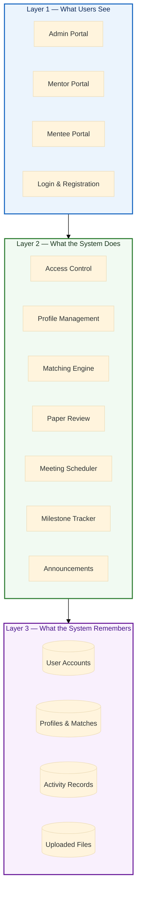
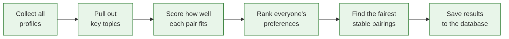
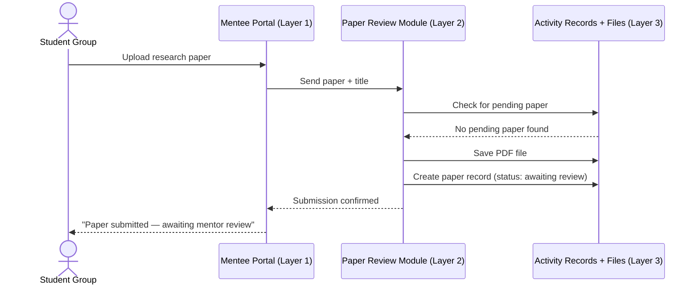

# Fortis Nexus — System Architecture

> **Who this is for:** Faculty, department heads, and program coordinators who want to understand how the system is organized without getting into technical details.

---

## What Is Fortis Nexus?

Fortis Nexus is a web platform that automatically pairs Computer Science mentors with student research groups, then keeps both sides connected throughout the mentoring relationship — from scheduling meetings to reviewing research papers and tracking milestones.

---

## How the System Is Organized

The system follows a **layered + modular architecture** — think of it as a three-story building where each floor has a clear job, and each floor is divided into separate rooms (modules) that handle specific tasks.

---

## Layer 1 — What Users See

This is the website itself — the screens that users look at and interact with. It is divided into separate portals, one for each type of user.

| Portal | Who uses it | What they can do |
|---|---|---|
| **Admin Portal** | Program administrators | Manage all accounts, trigger the matching process, post announcements, view system logs |
| **Mentor Portal** | Faculty mentors | View matched student groups, review papers, schedule meetings, set milestones, post announcements |
| **Mentee Portal** | Student research groups | View assigned mentor, submit papers, track milestones, view meeting schedules |
| **Login & Registration** | Everyone | Create an account, sign in, reset a password |

When a user signs in, the system automatically recognizes their role and sends them to the right portal — no manual navigation needed.

---

## Layer 2 — What the System Does

This layer contains all of the system's logic — the rules it follows and the work it performs behind the scenes. It is divided into seven independent modules, each responsible for one area of the system.

### Module 1 — Access Control
Makes sure users can only see and do what they are allowed to. When someone signs in, this module checks their identity, determines their role (admin, mentor, or mentee), and routes them to the correct portal. It also protects all pages so that no one can access another user's area.

### Module 2 — Profile Management
Handles the creation and editing of user profiles. Mentors fill in their area of expertise, availability, and research background. Mentee groups enter their research topic and team details. This module stores and updates that information whenever users make changes.

### Module 3 — Matching Engine
The core of the platform. When an admin triggers a matching run, this module:

Compatibility is scored across five factors:

| Factor | Weight | What it measures |
|---|---|---|
| Research topic overlap | 60% | How closely a mentor's expertise matches the group's research |
| Mentoring experience | 20% | How many thesis projects the mentor has previously guided |
| Availability overlap | 10% | How many days and time slots both sides share |
| Communication style | 5% | Whether both sides prefer the same meeting format (in-person, online chat, or video call) |
| Meeting frequency | 5% | How often both sides are available to meet |

The engine runs the pairing process from both the mentor's side and the student's side, then picks whichever result is fairest to everyone involved.

### Module 4 — Paper Review
Lets student groups submit their research papers to their assigned mentor. The mentor can download the paper, leave written feedback, and mark it as reviewed. The system allows one paper at a time per group — the next submission slot opens only after the mentor has reviewed the current one.

### Module 5 — Meeting Scheduler
Handles recurring meeting arrangements between mentors and their assigned groups. Mentors set the day and time for each group's meetings. Both sides can view upcoming sessions and the mentor can add notes after each meeting.

### Module 6 — Milestone Tracker
Allows mentors to set goals (milestones) for each student group — with a title, description, and due date. Mentors mark milestones as complete during or after meetings. Student groups see a read-only checklist that shows which goals are done, overdue, or still upcoming.

### Module 7 — Announcements
Provides two announcement channels:
- **Admin announcements** — sent by administrators to all users, only mentors, or only mentees
- **Mentor announcements** — sent by a mentor to their own assigned student groups

---

## Layer 3 — What the System Remembers

This layer stores all of the data that the system needs to function. It is organized into four stores.

| Store | What it holds |
|---|---|
| **User Accounts** | Login credentials and role assignments for every user |
| **Profiles & Matches** | Mentor profiles, mentee group profiles, and the resulting mentor-mentee pairings with their compatibility scores |
| **Activity Records** | All meetings, submitted papers, paper feedback, milestones, and announcements |
| **Uploaded Files** | PDF copies of research papers submitted by student groups |

Data in this layer is never accessed directly by the user interface — all requests go through Layer 2 first, which applies the appropriate rules and permissions before reading or writing anything.

---

## How the Three Layers Work Together

The following example traces a complete action — a student group submitting a paper — across all three layers:

No layer skips another. The portal never talks directly to the database, and the database never decides anything on its own.

---

## Role Summary

| | Admin | Mentor | Mentee |
|---|---|---|---|
| Sign in and manage account | Yes | Yes | Yes |
| Run the matching process | Yes | — | — |
| View all users and profiles | Yes | — | — |
| Create and delete accounts | Yes | — | — |
| Post system-wide announcements | Yes | — | — |
| View and edit own profile | — | Yes | Yes |
| View matched partners | — | Yes | Yes |
| Schedule meetings | — | Yes | — |
| Review papers and leave feedback | — | Yes | — |
| Create and manage milestones | — | Yes | — |
| Post announcements to their groups | — | Yes | — |
| Submit research papers | — | — | Yes |
| Track milestones and meetings | — | — | Yes |
| View mentor announcements | — | — | Yes |
