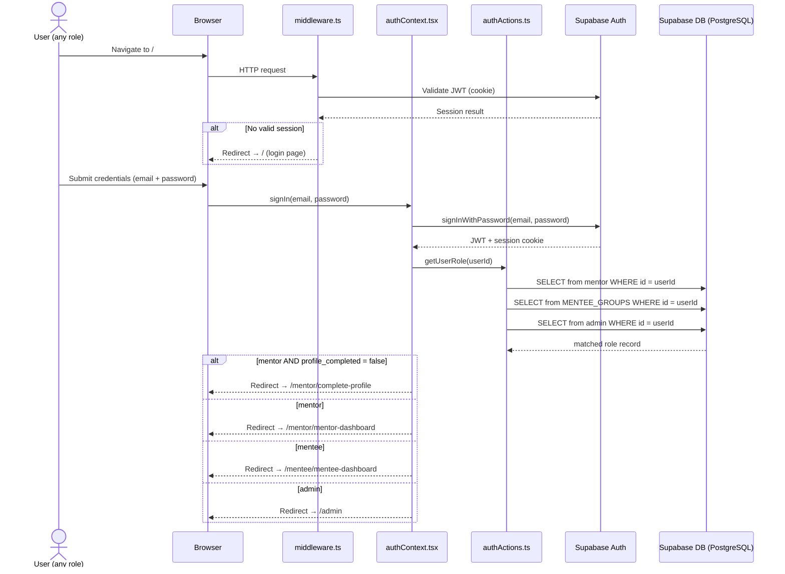
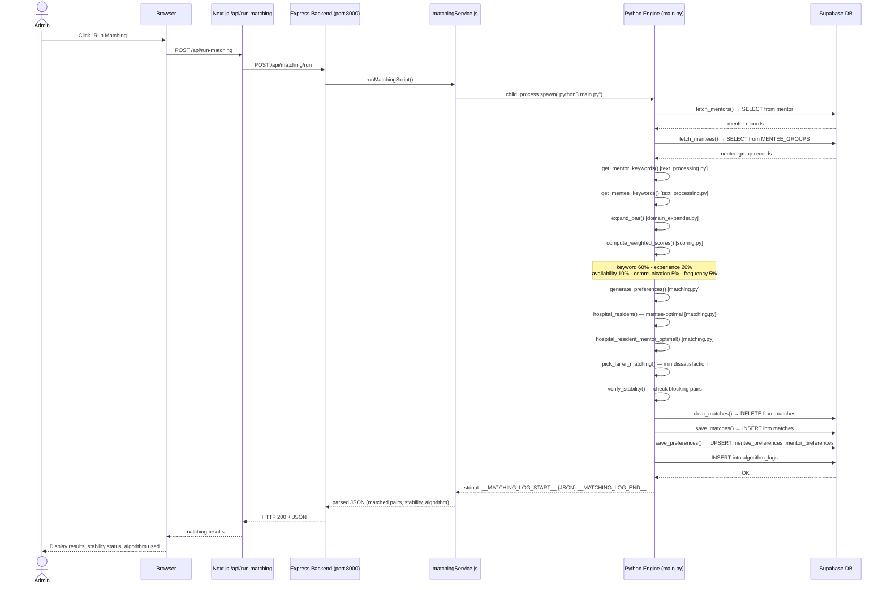
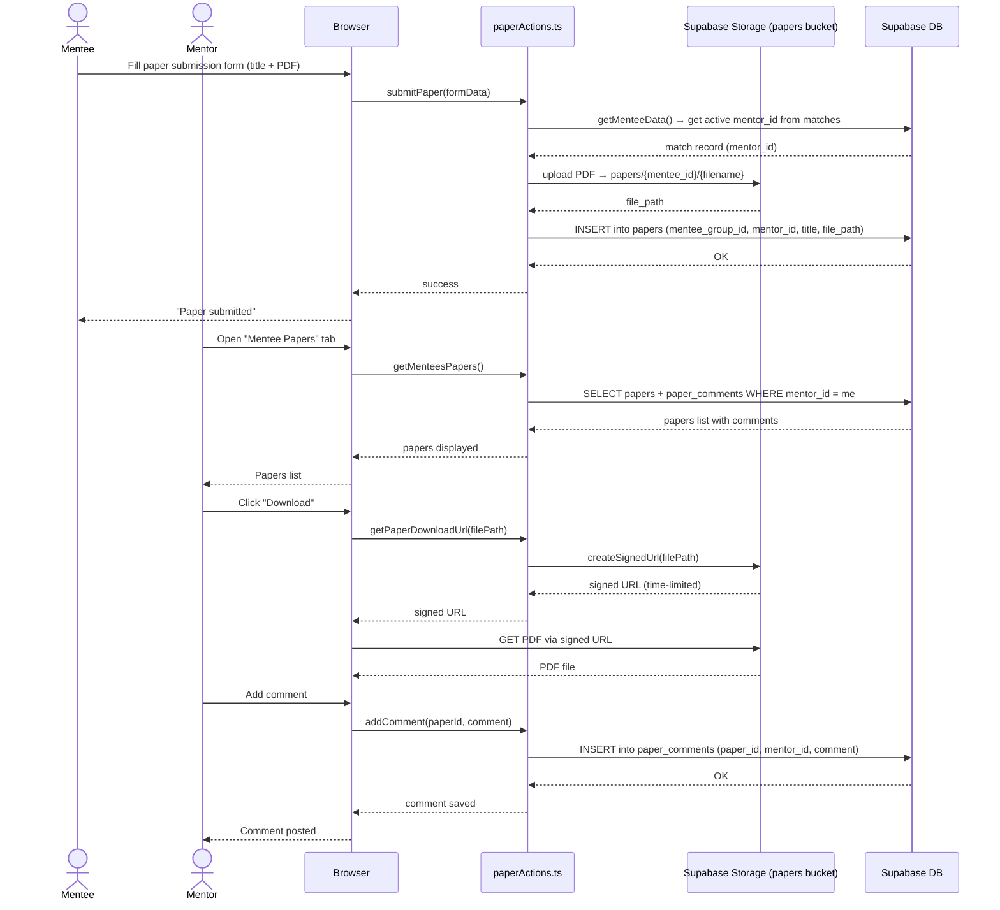
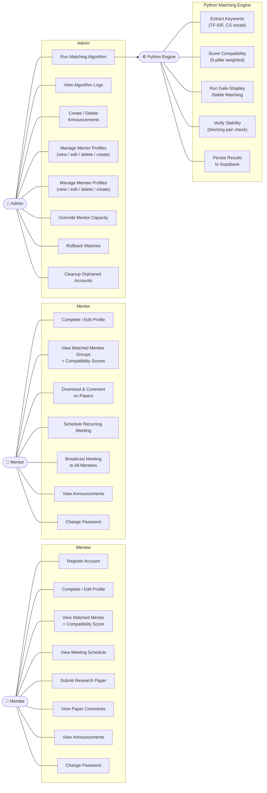
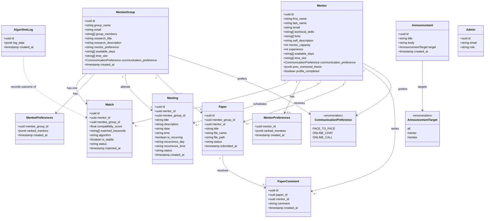
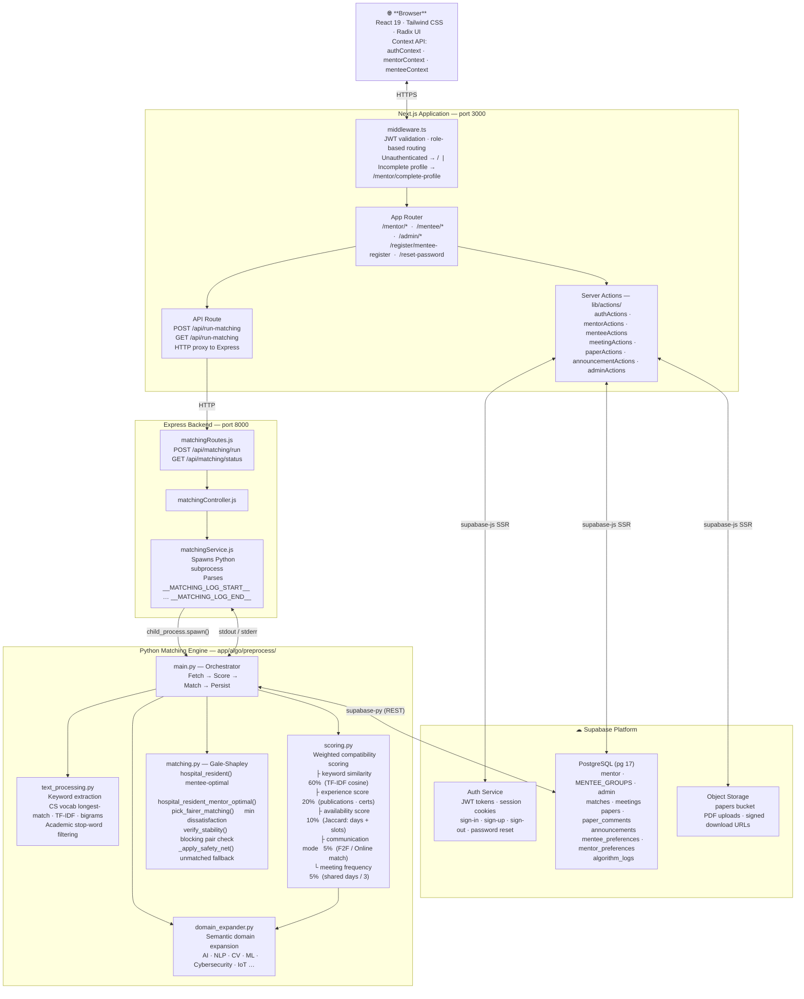

# System Diagrams — Fortis Nexus

> All diagrams use Mermaid syntax. Render in VS Code (Markdown Preview), GitHub, or [mermaid.live](https://mermaid.live).

---

## 1. Sequence Diagrams

### 1A. User Login & Role-Based Routing

---

### 1B. Admin Runs the Matching Algorithm

---

### 1C. Mentee Submits a Paper — Mentor Reviews

---

## 2. Use-Case Diagram

---

## 3. Class Diagram

---

## 4. System Architecture Diagram

---

## Scoring Weight Reference

| Pillar | Weight | Signal |
|--------|--------|--------|
| Keyword Similarity | 60% | TF-IDF cosine between mentor skills/description and mentee research |
| Experience | 20% | Prior mentored theses, publications, certifications |
| Availability | 10% | Jaccard overlap on days (60%) and time slots (40%) |
| Communication Mode | 5% | FACE_TO_FACE / ONLINE_CHAT / ONLINE_CALL compatibility |
| Meeting Frequency | 5% | Shared available days / 3.0 |

## Algorithm Summary

The system runs **two variants** of Gale-Shapley (Hospital-Resident):

1. **Mentee-optimal** — mentees propose; guarantees best outcome for mentees
2. **Mentor-optimal** — mentors propose; guarantees best outcome for mentors

The final assignment is whichever variant produces **lower total dissatisfaction** (average rank in preference list). Stability is then verified by checking for blocking pairs — any mentor-mentee pair that would both prefer each other over their current assignments.
