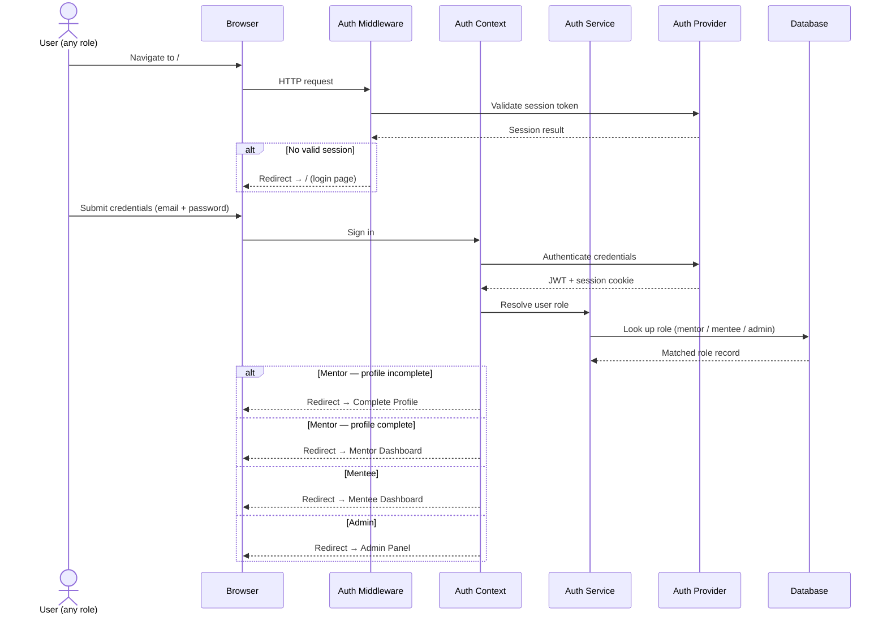
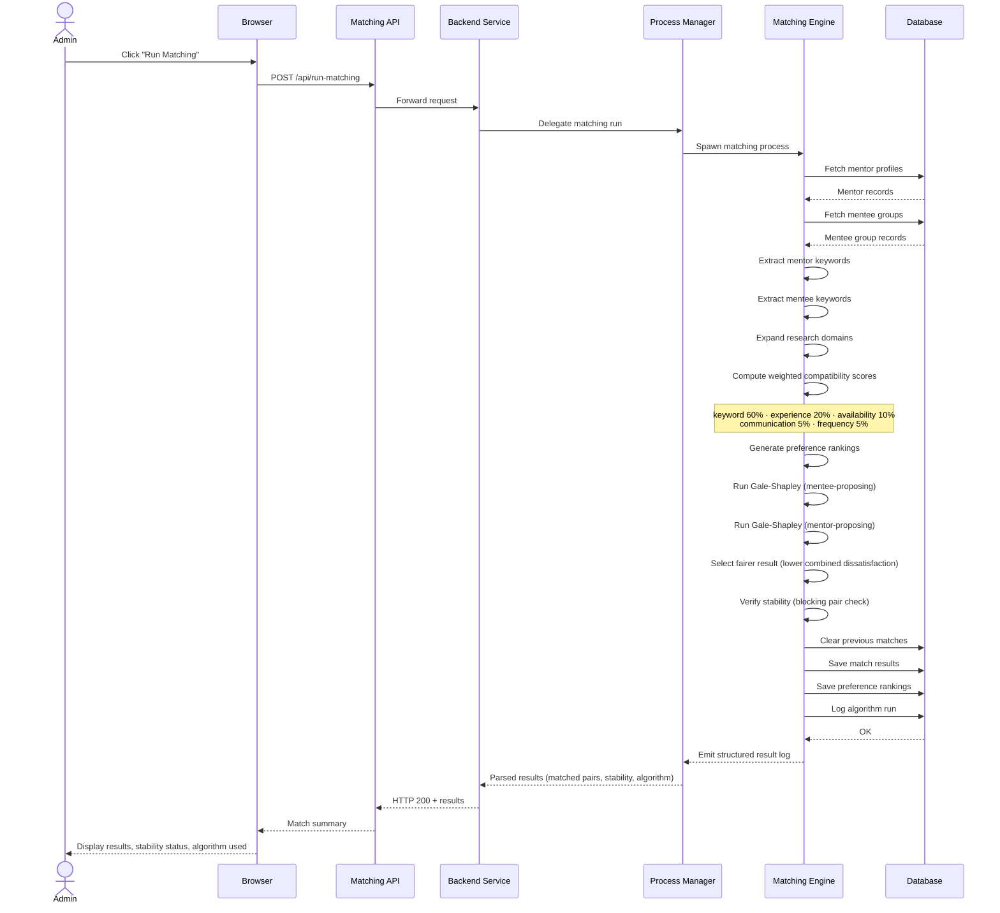
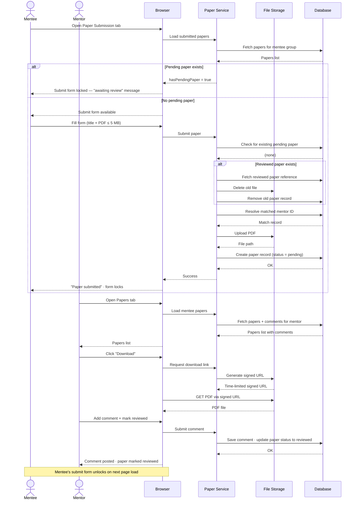
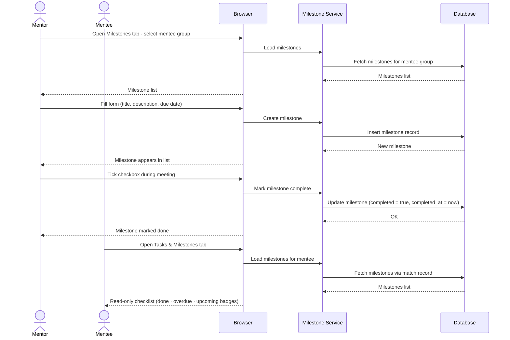
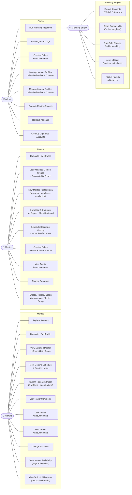

# System Diagrams — Fortis Nexus

> All diagrams use Mermaid syntax. Render in VS Code (Markdown Preview), GitHub, or [mermaid.live](https://mermaid.live).

---

## 1. Sequence Diagrams

### 1A. User Login & Role-Based Routing

This diagram shows how users sign into the system and get directed to the right page based on their role. When a user enters their email and password, the system checks who they are and whether their profile is set up. It then automatically sends them to their personal area — the mentor dashboard, mentee dashboard, admin panel, or the profile completion page if they haven't finished setting up yet.

---

### 1B. Admin Runs the Matching Algorithm

This diagram shows what happens when an admin triggers the matching process. The request travels from the admin's browser through the web application to a dedicated backend service, which starts the matching engine. The engine loads all mentor and mentee profiles, scores how well each pair fits together, runs the pairing algorithm from both sides, and saves the final results — all without any further manual input.

---

### 1C. Mentee Submits a Paper — Mentor Reviews

This diagram shows how research paper submissions flow between a mentee group and their assigned mentor. A mentee uploads a paper through the system, which stores it and records its status as pending. The mentor can then view all submitted papers, download them, leave written feedback, and mark each one as reviewed. Once a paper is reviewed, the mentee's submission slot opens up again for the next paper.

---

### 1D. Mentor Creates a Milestone — Mentee Views It

This diagram shows how mentors set goals for their mentee groups and how mentees track their progress. A mentor creates a milestone with a title, description, and due date, and can mark it as complete at any time — typically during a meeting. Mentees see a read-only view of all their assigned milestones, with clear labels showing which are done, which are overdue, and which are still upcoming.

---

## 2. Use-Case Diagram

This diagram shows everything each type of user can do in the system. Mentees can register, build their profile, view their matched mentor and compatibility score, track meetings and milestones, submit research papers, and read announcements. Mentors can manage their profile, view their assigned mentee groups, review and comment on submitted papers, schedule recurring meetings, create milestones, and post announcements. Admins can run the matching algorithm, manage all mentor and mentee accounts, override capacity limits, roll back matches, and review system logs. The matching engine operates automatically in the background — analyzing skills, scoring compatibility, running the pairing algorithm, and saving the results.

---

## 3. Class Diagram

This diagram shows the data model behind the system — what information is stored and how each piece connects to the others. Every mentor and mentee group has a profile. A match connects one mentor to one mentee group, and from that match, meetings, papers, milestones, and announcements all flow. Comments are attached to submitted papers, and both sides record their ranked preferences to support the matching process. Algorithm logs capture the outcome of each matching run for admin review.

```mermaid
classDiagram
    class Mentor {
        +uuid id
        +string first_name
        +string last_name
        +string email
        +string[] technical_skills
        +string[] forte
        +string self_description
        +int mentor_capacity
        +int experience
        +string[] available_days
        +string[] time_slot
        +CommunicationPreference communication_preference
        +jsonb prev_mentored_thesis
        +boolean profile_completed
    }

    class MenteeGroup {
        +uuid id
        +string group_name
        +string email
        +string[] group_members
        +string research_title
        +string research_description
        +string mentor_preference
        +string[] available_days
        +string[] time_slot
        +CommunicationPreference communication_preference
        +timestamp created_at
    }

    class Match {
        +uuid id
        +uuid mentor_id
        +uuid mentee_group_id
        +float compatibility_score
        +string[] matched_keywords
        +string algorithm
        +boolean is_stable
        +string status
        +timestamp matched_at
    }

    class Meeting {
        +uuid id
        +uuid mentor_id
        +uuid mentee_group_id
        +string title
        +string description
        +string date
        +string time
        +boolean is_recurring
        +string recurrence_day
        +string recurrence_time
        +string status
        +text notes
        +timestamp created_at
    }

    class Paper {
        +uuid id
        +uuid mentee_group_id
        +uuid mentor_id
        +string title
        +string file_name
        +string file_path
        +string status
        +timestamp submitted_at
    }

    class PaperComment {
        +uuid id
        +uuid paper_id
        +uuid mentor_id
        +string comment
        +timestamp created_at
    }

    class Announcement {
        +uuid id
        +string title
        +string body
        +AnnouncementTarget target
        +timestamp created_at
    }

    class MentorAnnouncement {
        +uuid id
        +uuid mentor_id
        +string title
        +string body
        +timestamp created_at
    }

    class Milestone {
        +uuid id
        +uuid mentor_id
        +uuid mentee_group_id
        +string title
        +text description
        +date due_date
        +boolean completed
        +timestamptz completed_at
        +timestamp created_at
    }

    class MenteePreferences {
        +uuid mentee_group_id
        +jsonb ranked_mentors
        +timestamp created_at
    }

    class MentorPreferences {
        +uuid mentor_id
        +jsonb ranked_mentees
        +timestamp created_at
    }

    class AlgorithmLog {
        +uuid id
        +jsonb log_data
        +timestamp created_at
    }

    class Admin {
        +uuid id
        +string email
        +string role
    }

    class CommunicationPreference {
        <<enumeration>>
        FACE_TO_FACE
        ONLINE_CHAT
        ONLINE_CALL
    }

    class AnnouncementTarget {
        <<enumeration>>
        all
        mentor
        mentee
    }

    Mentor "1" --> "0..*" Match : assigned to
    MenteeGroup "1" --> "0..1" Match : has one
    Mentor "1" --> "0..1" MentorPreferences : has
    MenteeGroup "1" --> "0..1" MenteePreferences : has
    Mentor "1" --> "0..*" Meeting : schedules
    MenteeGroup "1" --> "0..*" Meeting : attends
    MenteeGroup "1" --> "0..*" Paper : submits
    Mentor "1" --> "0..*" Paper : receives
    Paper "1" --> "0..*" PaperComment : receives
    Mentor "1" --> "0..*" PaperComment : writes
    Mentor "1" --> "0..*" MentorAnnouncement : broadcasts
    Mentor "1" --> "0..*" Milestone : creates
    MenteeGroup "1" --> "0..*" Milestone : assigned
    Announcement --> AnnouncementTarget : targets
    Mentor --> CommunicationPreference : prefers
    MenteeGroup --> CommunicationPreference : prefers
    AlgorithmLog ..> Match : records outcome of
```

---

## 4. System Architecture Diagram

This diagram shows how the different parts of the system are connected and how they communicate. Users interact through a browser-based interface that routes them to the correct page and securely handles all data operations through a cloud platform, which stores accounts, profiles, matches, meetings, papers, and uploaded documents. When an admin triggers the matching process, the web application passes the request to a separate backend service, which starts the matching engine. The engine analyzes mentor and mentee profiles, scores compatibility across five factors, runs the pairing algorithm from both sides to ensure fairness, and saves the final assignments back to the database.

> **View the interactive diagram:** Open `docs/system-architecture.drawio` in [draw.io](https://app.diagrams.net) or the VS Code draw.io extension.

The diagram is organized into four horizontal layers:

| Layer | Color | What it contains |
|---|---|---|
| **Presentation** | Blue | Login Page · Mentor Dashboard · Mentee Dashboard · Admin Panel |
| **Business** | Green | Auth Module · Profile Manager · Paper Review · Meeting Scheduler · Milestone Tracker · Announcement Manager · Matching Engine pipeline |
| **Persistence** | Yellow | User Store · Match Store · Paper Store · Meeting Store · Document Store |
| **Database** | Red | Supabase Database · Supabase Auth · File Storage |

The Matching Engine row within the Business layer shows the internal pipeline: **Matching Trigger → Skill Analyzer → Domain Mapper → Compatibility Scorer → Fair Pairing Engine**, connected left to right with directional arrows.

---

## Scoring Weight Reference

| Pillar | Weight | Signal |
|--------|--------|--------|
| Keyword Similarity | 60% | TF-IDF cosine between mentor skills/description and mentee research |
| Experience | 20% | Prior mentored theses, publications, certifications |
| Availability | 10% | Jaccard overlap on days (60%) and time slots (40%) |
| Communication Mode | 5% | FACE_TO_FACE / ONLINE_CHAT / ONLINE_CALL compatibility |
| Meeting Frequency | 5% | Shared available days / 3.0 |

## Algorithm Summary

The system uses **fair matching**: both variants of Gale-Shapley (Hospital-Resident) are always run, and the result with lower combined dissatisfaction is selected.

| Internal Variant | Who Proposes | Optimality |
|-----------------|-------------|-----------|
| Mentee-proposing HR | Mentees propose to mentors | Best for mentees |
| Mentor-proposing HR | Mentors propose to mentors | Best for mentors |

The final assignment is whichever variant produces **lower combined rank dissatisfaction** across both sides (average rank in each party's preference list). Stability is then verified by checking for blocking pairs — any mentor-mentee pair that would both prefer each other over their current assignments.
