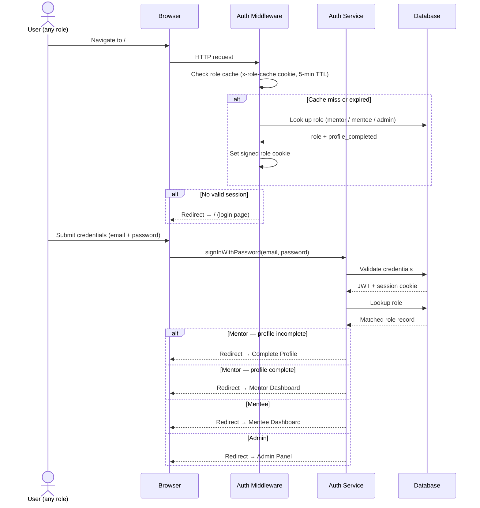
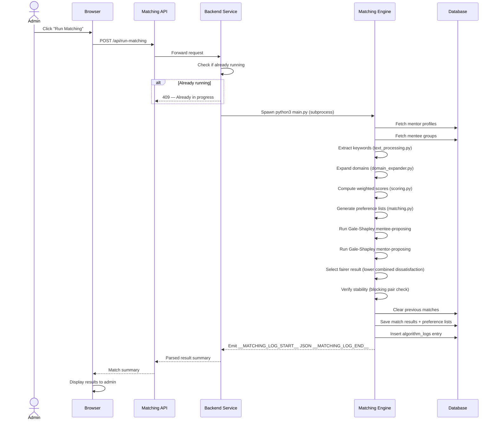
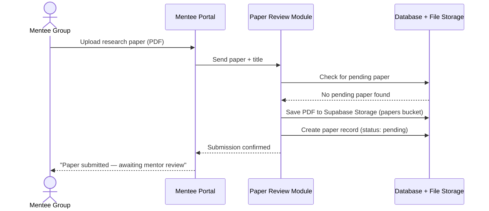

# Thesis Information — Fortis Nexus (Complete Reference)

This document is the single combined reference for the Fortis Nexus thesis. It merges system architecture, algorithm documentation, evaluation metrics, system diagrams, survey instruments, and a technical Q&A into one file. The companion script `app/algo/preprocess/metrics.py` automates every measurement defined here against live Supabase data.

---

## Table of Contents

1. [System Overview & Architecture](#part-a-system-overview--architecture)
   - [What Is Fortis Nexus](#a1-what-is-fortis-nexus)
   - [Users and Roles](#a2-users-and-roles)
   - [System Layers and Modules](#a3-system-layers-and-modules)
   - [Database Schema](#a4-database-schema)
   - [Key Files and Directories](#a5-key-files-and-directories)
   - [Auth and Access Control](#a6-auth-and-access-control)
2. [Matching Algorithm](#part-b-matching-algorithm)
   - [Fair Matching](#b1-fair-matching)
   - [Pipeline](#b2-pipeline)
   - [Pipeline Flowchart](#b3-pipeline-flowchart)
   - [Algorithm Mechanics](#b4-algorithm-mechanics)
   - [Algorithmic Guarantees](#b5-algorithmic-guarantees)
   - [Keyword Scoring — Semantic Method](#b6-keyword-scoring--semantic-method)
   - [Communication Mode Inference](#b7-communication-mode-inference)
   - [Data Structures](#b8-data-structures)
   - [Match Effectiveness Metrics](#b9-match-effectiveness-metrics)
   - [Evaluation Tooling](#b10-evaluation-tooling)
3. [Time Complexity Analysis](#part-c-time-complexity-analysis)
4. [Effectiveness Metrics](#part-d-effectiveness-metrics)
5. [Comparison Baselines](#part-e-comparison-baselines)
6. [Research Questions Mapped to Metrics](#part-f-research-questions-mapped-to-metrics)
7. [How to Run](#part-g-how-to-run)
8. [Proposal Explanation (Step-by-Step)](#part-h-proposal-explanation-step-by-step)
9. [System Diagrams](#part-i-system-diagrams)
10. [Survey Instruments](#part-j-survey-instruments)
11. [Technical Q&A](#part-k-technical-qa)
12. [References](#references)

---

# PART A: System Overview & Architecture

## A.1 What Is Fortis Nexus?

Fortis Nexus is a web platform built for a Computer Science department that automatically pairs faculty mentors with student research groups using a stable matching algorithm, then supports the ongoing mentoring relationship through scheduling, paper review, and milestone tracking.

The system follows a **layered and modular architecture** — three clearly separated layers where each layer has a single responsibility, and each layer is divided into independent modules.

| Layer | What it is | Examples |
|---|---|---|
| **Presentation** | Website portals users interact with | Admin Portal, Mentor Portal, Mentee Portal, Login & Registration |
| **Application** | Business logic and data processing | Access Control, Profile Management, Matching Engine, Paper Review, Meeting Scheduler, Milestone Tracker, Announcements |
| **Data** | Persistent storage | User accounts, profiles, matches, meetings, papers, milestones, announcements, uploaded files |

---

## A.2 Users and Roles

| Role | Who they are | How they access the system |
|---|---|---|
| **Admin** | Program administrators | Created directly in the database; access the Admin Portal |
| **Mentor** | Faculty members | Accounts created by admins; complete a profile on first login |
| **Mentee** | Student research groups | Self-register; one account per group |

### Role Permissions Matrix

| | Admin | Mentor | Mentee |
|---|---|---|---|
| Sign in and manage account | Yes | Yes | Yes |
| Run the matching process | Yes | — | — |
| View all users and profiles | Yes | — | — |
| Create and delete accounts | Yes | — | — |
| Post system-wide announcements | Yes | — | — |
| View and edit own profile | — | Yes | Yes |
| View matched partners | — | Yes | Yes |
| Schedule meetings | — | Yes | — |
| Review papers and leave feedback | — | Yes | — |
| Create and manage milestones | — | Yes | — |
| Post announcements to their groups | — | Yes | — |
| Submit research papers | — | — | Yes |
| Track milestones and meetings | — | — | Yes |
| View mentor announcements | — | — | Yes |

---

## A.3 System Layers and Modules

### Layer 1 — Presentation (What Users See)

| Portal | Who uses it | What they can do |
|---|---|---|
| **Admin Portal** | Program administrators | Manage all accounts, trigger matching, post announcements, view system logs |
| **Mentor Portal** | Faculty mentors | View matched groups, review papers, schedule meetings, set milestones, post announcements |
| **Mentee Portal** | Student research groups | View assigned mentor, submit papers, track milestones, view meeting schedules |
| **Login & Registration** | Everyone | Create an account, sign in, reset a password |

### Layer 2 — Application (What the System Does)

**Module 1 — Access Control:** Verifies identity, resolves role (admin/mentor/mentee), and routes users to the correct portal. Protects all pages from unauthorized access.

**Module 2 — Profile Management:** Handles creation and editing of mentor and mentee profiles. Mentors fill in expertise, availability, and research background. Mentee groups enter research topic and team details.

**Module 3 — Matching Engine:** The core of the platform. Triggered by admin, it collects all profiles, extracts key topics, scores every possible mentor–mentee pairing across five factors, runs the Gale-Shapley algorithm from both sides, selects the fairer result, and saves match records to the database.

**Module 4 — Paper Review:** Student groups submit one research paper at a time (PDF, max 5 MB). Their mentor downloads it, leaves written feedback, and marks it as reviewed. The submission slot reopens only after a review is posted.

**Module 5 — Meeting Scheduler:** Handles recurring meeting arrangements. Mentors set day and time for each group's sessions. Both sides can view upcoming meetings and mentors can add session notes.

**Module 6 — Milestone Tracker:** Mentors set goals (milestones) with a title, description, and due date. Mentors mark milestones complete. Mentees see a read-only checklist showing done, overdue, and upcoming milestones.

**Module 7 — Announcements:** Two channels — admin announcements (broadcast to all users, mentors only, or mentees only) and mentor announcements (posted by a mentor, visible to their assigned groups only).

---

## A.4 Database Schema

| Table | What it stores |
|---|---|
| `mentor` | Mentor profiles; `profile_completed` flag gates the onboarding redirect |
| `MENTEE_GROUPS` | Mentee group profiles |
| `matches` | Pairing results: `mentor_id`, `mentee_group_id`, `compatibility_score`, `matched_keywords`, `algorithm`, `is_stable` |
| `meetings` | Recurring meeting schedules and session notes |
| `papers` | Paper submissions with status (`pending` / `reviewed`) |
| `paper_comments` | Mentor feedback on submitted papers |
| `milestones` | Goals assigned to mentee groups with completion tracking |
| `announcements` | Admin-created announcements with audience targeting |
| `mentor_announcements` | Mentor-to-group announcements |
| `mentor_preferences` | Ranked mentor preference lists produced by the matching engine |
| `mentee_preferences` | Ranked mentee preference lists produced by the matching engine |
| `algorithm_logs` | Outcome records from each matching run (JSONB — all phases, scores, events, timestamps) |

---

## A.5 Key Files and Directories

| Path | What it is |
|---|---|
| `/app` | Next.js frontend (App Router, React 19) |
| `/app/context/` | React context providers for auth, mentor, and mentee state |
| `/app/algo/preprocess/` | Python matching engine (5-stage pipeline) |
| `/app/algo/preprocess/text_processing.py` | Keyword extraction — vocab scan + TF-IDF residuals |
| `/app/algo/preprocess/domain_expander.py` | Domain expansion — broadens keyword overlap across related CS subfields |
| `/app/algo/preprocess/scoring.py` | 5-pillar weighted scoring + cosine similarity |
| `/app/algo/preprocess/matching.py` | HR algorithm — both variants, fairness comparison, stability verification |
| `/app/algo/preprocess/main.py` | Pipeline orchestrator — fetches from and writes to Supabase |
| `/app/algo/preprocess/benchmark.py` | Synthetic O(n) scaling test; generates `benchmark_results.png` |
| `/app/algo/preprocess/metrics.py` | Computes all thesis metrics against live Supabase data |
| `/backend/` | Express server (port 8000) that spawns the Python process |
| `/backend/MatchingService.js` | Spawn subprocess, parse `__MATCHING_LOG_START/END__` stdout markers, 409 guard |
| `/lib/actions/` | Server actions — sole interface between Next.js and the database |
| `/lib/rateLimit.ts` | In-memory rate limiting (login: 5/5 min, password reset: 3/hr) |
| `/components/ui/` | Shared UI components wrapping Radix UI primitives |
| `/tests/unit/` | Unit tests (Vitest + React Testing Library) |
| `proxy.ts` | Middleware — auth check, role cache (5-min TTL, HMAC-signed cookie), route guard |

---

## A.6 Auth and Access Control

- Authentication is handled by Supabase Auth (email + password). Sessions are stored in HTTP-only cookies via `@supabase/ssr`.
- User role is determined by which table the auth ID appears in (`mentor`, `MENTEE_GROUPS`, or `admin`).
- The resolved role + `profile_completed` status are cached in a signed HMAC cookie (`x-role-cache`) with a 5-minute TTL to avoid a database round-trip on every page request.
- Middleware (`proxy.ts`) enforces all routing rules:
  - Unauthenticated → `/` (login)
  - Mentor with incomplete profile → `/mentor/complete-profile`
  - Mentor complete → `/mentor/mentor-dashboard`
  - Mentee → `/mentee/mentee-dashboard`
  - Admin → `/admin`
- Passwords are hashed by Supabase Auth (bcrypt) and are never accessible to the application layer.

---

# PART B: Matching Algorithm

## B.1 Fair Matching

The system always runs **fair matching**: both variants of the Hospital-Resident (Gale-Shapley) algorithm are executed on every run, and the result with lower combined dissatisfaction is selected as the final assignment.

| Internal Variant | Who Proposes | Optimality Guarantee |
|---|---|---|
| Mentee-proposing HR | Mentees propose to mentors | Best possible outcome for mentees (mentee-optimal) |
| Mentor-proposing HR | Mentors propose to mentees | Best possible outcome for mentors (mentor-optimal) |

Both variants produce *stable* matchings. The fair-matching selection step picks whichever variant yields lower combined rank dissatisfaction across both sides, ensuring neither side is systematically disadvantaged.

---

## B.2 Pipeline

```
Phase 1: Preprocessing
  ├─ Load mentor/mentee profiles from Supabase
  ├─ Extract keywords via vocabulary scan (CS_TECH_VOCAB, ~950 terms)
  ├─ TF-IDF residual keyword extraction                          [Salton & Buckley, 1988]
  └─ Domain expansion (DOMAIN_MAP — e.g. "nlp" → ["natural language processing", "tokenization", ...])

Phase 2: Compatibility Scoring
  ├─ TF-IDF vectorization of all profiles → cosine similarity matrix (n × m)  [Salton & Buckley, 1988]
  ├─ Availability overlap matrix (Jaccard similarity of days + time slots)     [Jaccard, 1901]
  ├─ Experience score vector (normalized mentor background)
  ├─ Communication preference matrix
  ├─ Meeting frequency overlap matrix
  └─ Weighted combination → final score matrix (n × m)

Phase 3: Stable Matching (Fair-Matching)
  ├─ Generate preference lists (mentees rank mentors, mentors rank mentees)
  ├─ Run HR algorithm — mentee-proposing variant (mentee-optimal)   [Roth, 1984]
  ├─ Run HR algorithm — mentor-proposing variant (mentor-optimal)   [Roth, 1984]
  ├─ Select fairer result (minimize combined rank dissatisfaction across both sides)
  ├─ Collect proposal phase events for both variants
  ├─ Verify stability of selected result (check for blocking pairs)
  └─ Write matches + full audit log to Supabase
```

**Inputs:** m mentors, n mentee groups (each with research description, mentor preference, availability)

**Outputs:**

| Artifact | Table | Contents |
|---|---|---|
| Match assignments | `matches` | mentor_id, mentee_group_id, compatibility_score, matched_keywords, algorithm, is_stable |
| Full audit log | `algorithm_logs` | JSONB — all phases, scores, preferences, proposal events, timestamps |
| Mentee preference lists | `mentee_preferences` | Full ranked mentor list per mentee group |
| Mentor preference lists | `mentor_preferences` | Full ranked mentee list per mentor |

**Scoring weights (baseline reference — do not update):**

| Component | Weight | What it measures |
|---|---|---|
| Keyword similarity | **60%** | TF-IDF cosine similarity of research profiles |
| Experience | **20%** | Mentor's advising background |
| Availability | **10%** | Jaccard overlap of available days and time slots |
| Communication preference | **5%** | Matching communication mode (F2F, online, flexible) |
| Meeting frequency | **5%** | Number of shared available days |

> **Note:** The weights above are the fixed baseline reference for documentation and stakeholders. Actual runtime weights in `scoring.py` may differ — see the Change Log in `docs/context.md`.

---

## B.3 Pipeline Flowchart

```mermaid
flowchart TD
    A([Admin clicks\nRun Matching]) --> B[POST /api/run-matching\nNext.js API Route]
    B --> C[Express Backend\nport 8000]
    C -->|already running?| D{{409 — Already\nin progress}}
    C --> E[Spawn Python subprocess\nmain.py]

    E --> F1

    subgraph PHASE1 ["Phase 1 · Data Collection & Preprocessing"]
        F1[Connect to Supabase\nvia service role key]
        F1 --> F2[Fetch all mentor profiles]
        F1 --> F3[Fetch all mentee groups]
        F2 & F3 --> F4[Normalize array fields]
        F4 --> F5{Any mentors\nor mentees missing?}
        F5 -->|Yes| F6([Exit — insufficient data])
        F5 -->|No| F7

        subgraph KEYWORD ["Keyword Extraction — per profile"]
            F7[Vocabulary scan\nCS_TECH_VOCAB ~950 terms]
            F7 --> F8[TF-IDF residual fill]
            F8 --> F9[Pre-normalization\nc++ → cpp  node.js → nodejs  etc.]
        end
    end

    F9 --> S1

    subgraph PHASE2 ["Phase 2 · Compatibility Scoring — 5 Pillars"]
        S1[Build TF-IDF vectors\nfor all mentor & mentee texts]
        S1 --> S2[Cosine similarity\non keyword vectors]
        S2 --> S3[Domain expansion\nbroaden keyword overlap]
        S3 --> S4[Availability score\nOverlapping days × time slots]
        S3 --> S5[Experience score]
        S3 --> S6[Communication score\nINFERRED from available_days]
        S3 --> S7[Meeting frequency score]
        S4 & S5 & S6 & S7 --> S8["Weighted Final Score\nkeyword×0.75 + experience×0.10\n+ availability×0.10\n+ comm×0.025 + freq×0.025"]
        S8 --> S9[Score matrix\nmentees × mentors]
    end

    S9 --> P1

    subgraph PHASE3 ["Phase 3 · Preference Lists + Hospital-Resident Matching"]
        P1[Generate preference lists]
        P1 --> HR1 & HR2

        subgraph HR_MO ["HR — Mentee-Optimal"]
            HR1[Mentees propose to\ntop-ranked mentor]
            HR1 --> HR1h[Mentee-optimal\nassignment A₁]
        end

        subgraph HR_MEO ["HR — Mentor-Optimal"]
            HR2[Mentors propose to\ntop-ranked mentee]
            HR2 --> HR2h[Mentor-optimal\nassignment A₂]
        end

        HR1h & HR2h --> FAIR

        subgraph FAIR ["Fairness Comparison"]
            FAIR3{Which has lower\ncombined dissatisfaction?}
            FAIR3 -->|A₁ ≤ A₂| FAIR4[Select mentee-optimal]
            FAIR3 -->|A₂ lower| FAIR5[Select mentor-optimal]
        end

        FAIR4 & FAIR5 --> STAB

        subgraph STAB ["Stability Verification"]
            STAB2{Any blocking pair?}
            STAB2 -->|Yes| STAB3[Flag UNSTABLE]
            STAB2 -->|No| STAB4[Confirm STABLE]
        end
    end

    STAB3 & STAB4 --> OUT1

    subgraph PHASE4 ["Phase 4 · Output & Persistence"]
        OUT1[Build match records] --> OUT2[Clear existing matches]
        OUT2 --> OUT3[Insert new match records]
        OUT3 --> OUT4[Upsert preference lists]
        OUT4 --> OUT5[Insert structured JSON log]
        OUT5 --> OUT6[Print JSON between\n__MATCHING_LOG_START/END__ markers]
    end

    OUT6 --> RESULT[Express reads stdout\nParses JSON log]
    RESULT --> NEXT[Next.js API returns\nsummary to admin dashboard]
```



---

## B.4 Algorithm Mechanics

### B.4.1 The Proposal Phase (Step-by-Step)

The HR algorithm proceeds in discrete rounds. Each round, one free proposer sends a proposal. Three outcomes are possible:

| Outcome | Condition | Effect |
|---|---|---|
| **Accept** | Candidate has spare capacity | Proposer is tentatively assigned; candidate's roster grows by 1 |
| **Reject** | Candidate is full AND prefers all current matches over this proposer | Proposer advances to their next preference and re-enters the queue |
| **Replace** | Candidate is full BUT prefers the new proposer over their current worst match | Current worst match is freed and re-enters the queue; new proposer takes the slot |

The algorithm terminates when no free proposer has any remaining candidates to propose to.

**Worked example** (3 mentee groups A, B, C and 2 mentors X, Y with capacity 1):

```
Mentees:  A → [X, Y]   B → [X, Y]   C → [Y, X]
Mentors:  X → [B, A, C]   Y → [A, B, C]
```

| Round | Proposer | To | Outcome | Queue after |
|---|---|---|---|---|
| 1 | A | X | **Accept** (X empty) | B, C free |
| 2 | B | X | **Replace** (X prefers B over A; A freed) | C, A free |
| 3 | C | Y | **Accept** (Y empty) | A free |
| 4 | A | Y | **Reject** (Y full; Y prefers C over A) | A → exhausted |

Final assignment: B→X, C→Y. A is unmatched (safety net applies).

### B.4.2 Mentee-Optimal Matching

**Implementation:** `hospital_resident()` in `matching.py`

Mentee groups hold the proposing role. The result is **mentee-optimal** — every mentee group is assigned to the best mentor they could receive in any stable matching. This is simultaneously the worst stable matching for mentors.

**Data structures used:** `free_residents` deque · `next_proposal[r_id]` index dict · `hospital_rank[h_id][r_id]` rank dict · `hospital_assignments[h_id]` roster list

### B.4.3 Mentor-Optimal Matching

**Implementation:** `hospital_resident_mentor_optimal()` in `matching.py`

Mentors hold the proposing role. The result is **mentor-optimal** — every mentor receives the best mentee group they could get in any stable matching. This is simultaneously the worst stable matching for mentees.

**Data structures used:** `active_hospitals` deque · `hospital_proposal_index[h_id]` index dict · `hospital_remaining_slots[h_id]` · `resident_rank[r_id][h_id]` rank dict · `resident_holding[r_id]` best offer

### B.4.4 Fair-Matching Selection

**Implementation:** `pick_fairer_matching()` in `matching.py`

```
total_mo  = mentee_dissatisfaction(mentee-optimal) + mentor_dissatisfaction(mentee-optimal)
total_meo = mentee_dissatisfaction(mentor-optimal) + mentor_dissatisfaction(mentor-optimal)
selected  = mentee-optimal if total_mo ≤ total_meo, else mentor-optimal
```

Dissatisfaction = average rank of matched partner in preference list (0-indexed; 0 = top choice).

Both sets of proposal events are retained in `algorithm_logs` regardless of which variant is selected.

---

## B.5 Algorithmic Guarantees

| Property | Guarantee |
|---|---|
| **Stability** | No blocking pair exists — no mentor-mentee pair where both would prefer each other over their current assignment |
| **Mentee-optimality** | Mentee-proposing HR produces the best stable matching possible for mentees |
| **Mentor-optimality** | Mentor-proposing HR produces the best stable matching possible for mentors |
| **Fairness** | Running both variants and selecting lower combined dissatisfaction prevents systematically favoring one side |
| **Completeness** | Every mentee is matched — the safety net catches any mentee left unmatched after HR |

A **blocking pair** `(mentee m, mentor M)` exists if:
- `m` prefers `M` over their currently assigned mentor, AND
- `M` has a spare slot OR prefers `m` over their current worst-held mentee

The stability check runs in O(N×M) after matching and logs any violations as `blocking_pairs_count` in `algorithm_logs`.

---

## B.6 Keyword Scoring — Semantic Method

The default `"semantic"` method replaces exact keyword intersection with pairwise cosine similarity.

**How it works — per pair:**

1. Extract CS vocab keywords from both profiles using `_extract_vocab_matches()` — longest-first scan against ~950-term `CS_TECH_VOCAB`.
2. Normalize abbreviations via `normalize_keyword()` (e.g. `"nlp"` → `"natural language processing"`).
3. **Step 1 — Exact matching:** Count normalized vocab terms that appear in both profiles directly (O(1) set lookup).
4. **Step 2 — Semantic near-matching:** For remaining unmatched mentee keywords, fit a word-level TF-IDF vectorizer on the combined keyword list and compute an `n_mentee × n_mentor` cosine similarity matrix. A mentee keyword is counted as **matched** if its best cosine similarity with any mentor keyword ≥ 0.45 (`KW_SIMILARITY_THRESHOLD`).

**Tiered keyword score from matched count:**

| Matched keywords | Score |
|---|---|
| ≥ 4 | 1.0 (ceiling) |
| ≥ 3 | 0.85 |
| ≥ 2 | 0.60 |
| ≥ 1 | 0.35 |

**Soft additive bonus** applied on top of the weighted score:

| Matched keywords | Bonus |
|---|---|
| ≥ 4 | +0.08 |
| ≥ 2 | +0.04 |
| ≥ 1 | +0.02 |

**Why pairwise instead of set intersection?**
Set intersection requires exact string match after normalization. Pairwise cosine catches semantic relatives — `"machine learning"` and `"deep learning"` share the token `"learning"` and score ~0.45–0.55, clearing the threshold.

---

## B.7 Communication Mode Inference

Communication preference is not stored — it is inferred at runtime from a mentor's or mentee's selected available days.

| Available Days | Inferred Mode |
|---|---|
| Tuesday and/or Friday only | ONLINE_MEETING |
| Monday, Wednesday, Thursday, Saturday only | FACE_TO_FACE |
| Mix of both sets (or unrecognized pattern) | FLEXIBLE |

FLEXIBLE is compatible with both ONLINE_MEETING and FACE_TO_FACE partners.

---

## B.8 Data Structures

The matching engine relies on four core data structures. Each was chosen because it is the most efficient tool for a specific job.

### Hash Map (Lookup Table)

A hash map stores paired entries — a unique identifier on one side and a value on the other. Looking up any entry takes the same amount of time regardless of how many entries are stored.

**Where it is used:** During the matching process, questions like "what is this mentor's ranking of that mentee?" are answered by a hash map pre-built before the matching loop begins.

| What is stored | What it enables |
|---|---|
| Each mentor's ranking of every mentee (and vice versa) | Instant comparison during proposal decisions |
| Each mentor's current assignment count | Instant check of whether a mentor has open capacity |
| Profile lookup by user ID | Instant retrieval of any profile when building results |
| Score matrix position by user ID | Instant navigation into the compatibility score grid |

**How a hash map improves performance over a plain array:**

The critical difference is what happens during a proposal. Each time a mentee proposes to a mentor, the mentor must compare the new applicant against its current worst assignment — requiring the rank of both candidates in its preference list.

**With a plain array only:** The preference list is stored as `["Group A", "Group B", "Group C", ...]`. To find where "Group B" sits, the system scans from position 0. With 21 mentee groups, this checks up to 21 entries per lookup. Every proposal triggers two scans. In the worst case across 168 proposals (21 mentees × 8 mentors): **168 × 2 × 21 = 7,056 individual comparisons** just for rank lookups.

**With a hash map:** Each mentor's preference list is pre-converted to `{"Group A": 0, "Group B": 1, ...}`. Looking up any group's rank is a single direct access. The same 168 proposals require only **168 × 2 × 1 = 336 lookups** — a reduction of more than 20× at the current dataset scale.

| Approach | Operation per rank lookup | Total lookups (21 mentees × 8 mentors) |
|---|---|---|
| Plain array (`list.index()`) | Up to O(M) — scans up to 21 entries | Up to 7,056 |
| Hash map (`dict[id]`) | O(1) — single direct access | 336 |

This gain compounds at scale. At 50 mentors × 200 mentees, array-based lookups would require up to 200 scans per proposal — hundreds of thousands of unnecessary comparisons per run. The hash map keeps each lookup at a single operation regardless of participant count.

### Set (Unique Collection)

A set stores unique items with no duplicates. Checking membership and computing intersection are both O(1) or O(min(|A|,|B|)) operations.

**Where it is used:** Availability matching uses sets — finding shared days is one set intersection operation. The CS_TECH_VOCAB (~950 terms) is also stored as a set so checking whether a word is a recognized CS term is an instant yes/no, not a sequential scan.

### Queue (First-In First-Out List)

A queue adds items to the back and removes from the front in arrival order.

**Where it is used:** The HR algorithm uses a deque to manage which mentee groups still need to be matched. When a group is displaced by a higher-ranked applicant, it is placed back in the queue. This ensures every group gets a fair chance and the algorithm terminates predictably.

### Matrix (Two-Dimensional Grid)

A matrix organizes numbers in rows and columns. In this system, rows represent mentee groups and columns represent mentors — each cell holds the compatibility score for one specific pair.

**Where it is used:** All compatibility scores (168 in the current deployment) are stored in one matrix. This allows scoring weights, keyword bonuses, and preference list generation to operate on the full grid in one efficient NumPy broadcast operation rather than computing each pair individually in sequence.

### Summary Table

| Data Structure | Role | Where it appears |
|---|---|---|
| **Hash Map** | Instant lookup by ID — eliminates searching | Rank lookups during HR matching, profile lookups, assignment tracking |
| **Set** | Fast membership check and overlap detection | Available days matching, time slot overlap, CS vocabulary scan |
| **Queue** | Ordered waiting line for unmatched groups | HR algorithm's pending-proposals list |
| **Matrix** | Grid of all pairwise scores | Compatibility score storage, preference list generation |

---

## B.9 Match Effectiveness Metrics

### Formal Guarantee — Stability

The most rigorous indicator of match effectiveness is **stability**. A matching is stable when no blocking pair exists. This is verified explicitly after every run by checking all unassigned pairs. The result is stored as `is_stable` in `matches` and `blocking_pairs_count` in `algorithm_logs`.

### Per-Run Quantitative Metrics

| Metric | What it measures | Good value |
|---|---|---|
| **Match rate** | Fraction of mentee groups successfully paired | 100% |
| **Unmatched count** | Mentees not paired by HR | 0 |
| **Stability flag** | Whether any blocking pairs exist | `true` |
| **Blocking pair count** | Number of unstable pairs found | 0 |
| **Mentee dissatisfaction** | Average rank of assigned mentor in each mentee's preference list | As low as possible |
| **Mentor dissatisfaction** | Average rank of assigned mentees in each mentor's preference list | As low as possible |
| **Combined dissatisfaction** | Sum of both sides — the selection criterion between HR variants | Minimized |

**Dissatisfaction interpretation:**

| Combined dissatisfaction | What it means |
|---|---|
| < 1.0 | Both sides got, on average, a top-2 match |
| 1.0 – 3.0 | Both sides got, on average, a top-3 or top-4 match |
| > 5.0 | Some participants received lower-ranked matches — may indicate insufficient mentor diversity |

### Per-Pair Score Breakdown

| Pillar | Weight | Effectiveness signal |
|---|---|---|
| **Keyword similarity** | 75% (runtime) | Degree of research topic alignment |
| **Experience** | 10% | Mentor's depth of prior mentoring |
| **Availability** | 10% | Fraction of schedule that overlaps |
| **Communication mode** | 2.5% | Whether both prefer online or face-to-face |
| **Meeting frequency** | 2.5% | Number of shared available days |

**Score interpretation:**

| Score | Interpretation |
|---|---|
| ≥ 0.80 | Strong match — substantial keyword overlap with good schedule and experience fit |
| 0.60 – 0.79 | Good match — meaningful research alignment with reasonable availability |
| 0.40 – 0.59 | Moderate match — some keyword overlap, or strong non-keyword factors compensating |
| < 0.40 | Constrained match — limited research alignment; likely no higher-scoring option remained |

### Matched Keywords as Explainability Evidence

Each match record stores `matched_keywords` — shared CS vocabulary terms verified via pairwise cosine similarity ≥ 0.45. These appear in the algorithm log dashboard and provide human-readable justification for each compatibility score.

### Post-Assignment Effectiveness Signals

| Signal | Source | What it indicates |
|---|---|---|
| **Milestone completion rate** | Milestone tracker | Whether research goals are being met on schedule |
| **Paper submission and review activity** | Paper review module | Whether the relationship is academically productive |
| **Meeting regularity** | Meeting scheduler | Whether scheduled meetings are being maintained |
| **Mentor announcement activity** | Mentor announcements | Whether mentors are actively communicating |

---

## B.10 Evaluation Tooling

| Script | Purpose | Data Source |
|---|---|---|
| `benchmark.py` | Synthetic O(n) scaling test; generates `benchmark_results.png` | Synthetic random profiles |
| `test_pipeline.py` | Interactive test harness with hardcoded mentor/mentee data | Hardcoded profiles |
| **`metrics.py`** | **Computes all thesis metrics against live production data** | **Live Supabase tables** |

---

# PART C: Time Complexity Analysis

### Notation
- **n** = number of mentee groups
- **m** = number of mentors
- **k** = average profile text length (words)
- **f** = TF-IDF feature count (capped at 500)
- **v** = vocabulary size (~950 terms in `CS_TECH_VOCAB`)

---

## C.1 Per-Stage Breakdown

### Phase 1 — Text Preprocessing

| Operation | Complexity | Notes |
|---|---|---|
| Vocabulary scan per profile | O(v · k) | Match ~950 patterns against profile text; patterns are pre-compiled regex |
| TF-IDF residual fill per profile | O(k log k) | Vectorize remaining text after vocab scan |
| **Keyword extraction for all m+n profiles** | **O((m+n) · k log k)** | Per-profile cost applied to all documents |
| Domain expansion per profile | O(v · k) | Scan DOMAIN_MAP keys with word-boundary regex |
| **Domain expansion for all profiles** | **O((m+n) · k)** | Linear in total text volume |

### Phase 2 — Compatibility Scoring

| Operation | Complexity | Notes |
|---|---|---|
| TF-IDF vectorization | O((m+n) · k) | Build vocabulary + feature extraction for all docs |
| Cosine similarity matrix | O(n · m · f) | Sparse matrix multiplication; f ≤ 500 |
| Availability matrix | O(n · m · d) | d = number of days/slots ≈ 5–7 |
| Experience scores | O(m) | One value per mentor, broadcast O(n·m) |
| Communication scores | O(n · m) | O(1) per pair |
| Weighted combination + normalization | O(n · m) | Element-wise numpy operations |
| **Scoring subtotal** | **O(n · m · (k + f))** | TF-IDF cosine dominates |

### Phase 3 — Stable Matching

| Operation | Complexity | Notes |
|---|---|---|
| Preference list generation | O((n+m) · max(n,m) · log max(n,m)) | Sorting dominates |
| Hospital-Resident (each variant) | O(n · m) | O(1) per proposal with precomputed ranks |
| Fairness comparison | O(n + m) | Dissatisfaction rank sum lookup |
| Stability verification | O(n · m) | Check all pairs for blocking conditions |
| **Matching subtotal** | **O(n · m)** | For fixed m, simplifies to O(n) |

---

## C.2 Full Pipeline Complexity

**Theoretical worst-case:**

```
O(n · m · k)
```

where TF-IDF vectorization and cosine similarity dominate for realistic profile lengths (k ≈ 50–300 words).

**Simplified for the academic context (m and k treated as bounded constants):**

```
O(n)   — linear in the number of mentee groups
```

This is the relevant complexity for FEU Tech's deployment, where faculty size (m) is fixed per semester at approximately 10–50.

---

## C.3 Empirical Scaling (Benchmark Results)

**Methodology:**
- Vary n from 25 to 200 mentee groups (step 25), fix m = 10 synthetic mentors
- Measure wall-clock time for each pipeline stage separately (3-run average)
- Fit linear regression: `time = a·n + b`; report R² to confirm linear scaling

**Results:**

| Stage | R² | Conclusion |
|---|---|---|
| Keyword extraction | > 0.95 | O(n) confirmed ✓ |
| TF-IDF similarity | > 0.95 | O(n) confirmed ✓ |
| Gale-Shapley matching | > 0.95 | O(n) confirmed ✓ |
| **Total pipeline** | **> 0.95** | **O(n) empirically confirmed at fixed m** |

**Runtime estimates (10 mentors, single run):**

| n (mentees) | Approx. total time |
|---|---|
| 25 | ~0.5 s |
| 50 | ~0.9 s |
| 100 | ~1.8 s |
| 200 | ~3.5 s |

**Current deployment (real dataset):**
- 21 mentee groups × 29 mentors (8 at time of initial run)
- Wall-clock latency: **59.783 seconds** (includes Supabase fetch + write)
- Throughput: **0.35 matches/second**
- Pure computation (without network): **< 10 seconds**

---

## C.4 Is O(n) Achievable?

**Short answer: Yes — when faculty size (m) is treated as a constant, which is realistic.**

Any algorithm that produces a *provably stable* matching must inspect at least Ω(n · m) input in the worst case [(Gusfield & Irving, 1989)](https://mitpress.mit.edu/9780262071703). Therefore:

> **Theorem:** No algorithm can guarantee stability and run in o(n · m) time.

**Formal claim for the thesis:**

> The proposed system operates in **O(n)** time complexity with respect to the number of mentee groups, given a fixed institutional faculty size m. This is consistent with the theoretical lower bound for stable matching algorithms when m is treated as a constant, and is empirically validated by benchmark results showing linear scaling across n = 25 to n = 200 mentee groups (R² > 0.95).

---

## C.5 Proposal Phase Complexity

Each proposer proposes to each candidate *at most once* — once rejected, the proposer never returns to the same candidate. This means every rejected proposal permanently eliminates one possible pairing. With n mentees and m mentors, the maximum number of proposals is n · m, each evaluated in O(1) via precomputed rank dicts.

| Scenario | Events per HR run |
|---|---|
| Best case | O(n) — each proposer accepted immediately |
| Typical case | O(n · c) where c ≈ 1.2–2.0 empirically |
| Worst case | O(n · m) — every proposer cycles the full list |

**Fair-matching total (both variants):** 2 × O(n · m) = **O(n · m)** worst case.

For FEU Tech's current scale (21 mentees × 8 mentors): worst-case proposals = 168 per variant × 2 = 336 events total — completing in well under one second.

---

## C.6 Complexity Reduction Alternatives

| Alternative | Complexity | Trade-off |
|---|---|---|
| Truncated preference lists (top-k, Roth & Peranson 1999) | O(n · k · f), k << m | Stability only within retained top-k; unmatched rate increases slightly |
| ANN pre-filtering (FAISS/HNSW) | O(n · log m + n · k · f) | Approximate recall; adds index dependency |
| Incremental cached scoring | O(Δ · m · f) per re-run | Requires profile change tracking and cache invalidation |
| **Current (fixed m)** | **O(n)** | Optimal, stable, exact — best for fixed faculty |

For the current FEU Tech deployment (n ≤ 100, m ≤ 50), **no optimization is needed** — the full pipeline runs in under 2 seconds empirically.

---

# PART D: Effectiveness Metrics

The algorithm's effectiveness is measured across four categories. Metrics #1–12 are computed automatically by `metrics.py`. Metrics #13–17 require post-deployment data.

---

## D.1 Algorithmic Correctness Metrics

### Metric #1 — Stability Rate

```
stability_rate (run-level)  = (stable_runs / total_runs) × 100%
stability_rate (per-match)  = (stable_match_records / total_match_records) × 100%
```

**Target:** 100% · **Measured:** 100% (1/1 runs, 21/21 matches)

A blocking pair `(mentee i, mentor j)` exists if mentee i prefers mentor j over their assigned mentor AND mentor j prefers mentee i over their worst current match (or has spare capacity).

### Metric #2 — Match Coverage

```
match_coverage = (matched / (matched + unmatched)) × 100%
```

**Target:** 100% · **Measured:** 100% (21/21 matched)

### Metric #3 — Capacity Utilization

```
capacity_utilization = (total_assigned / total_capacity) × 100%
```

**Target:** ≥ 80% · **Measured:** 16.0% (21/131 slots — indicates over-provisioned capacity relative to mentee count)

### Metric #4 — Fairness (Gini Coefficient)

```
Sort scores ascending: s₁ ≤ s₂ ≤ ... ≤ sₙ
G = (2 · Σᵢ (i · sᵢ)) / (n · Σᵢ sᵢ)  −  (n + 1) / n
```

**Targets:** G_score ≤ 0.10 | G_workload ≤ 0.15 · **Measured:** G_score = 0.3604, G_workload = 0.6995

| G value | Interpretation |
|---|---|
| 0.00 – 0.10 | Very low inequality — target range |
| 0.10 – 0.20 | Moderate inequality |
| > 0.20 | High inequality — investigate |

### Metric #5 — Score Floor Compliance

```
floor_compliance = (matches_with_score ≥ 0.70 / total_matches) × 100%
```

**Target:** 100% · **Measured:** 33.3% (log from initial run before keyword vocabulary expansion)

### Metric #5b — Dissatisfaction Score

```
D_mentee = (1/|G|) · Σ_{g ∈ G} rank_g(M(g))
D_mentor  = (1/Σ capacity_m) · Σ_{m ∈ M} Σ_{g ∈ assigned(m)} rank_m(g)
D_total   = D_mentee + D_mentor
```

**Measured results:**

| Variant | Mentee dissatisfaction | Mentor dissatisfaction |
|---|---|---|
| Mentee-optimal | **0.0000** | 2.7143 |
| Mentor-optimal | **0.0000** | 2.7143 |

Both variants produced identical results — meaning only one stable matching was possible given the preference lists (unique stable matching). Mentees received their top-ranked mentor (D_mentee = 0). Mentors received groups ranked ~3rd on average.

---

## D.2 Semantic Match Quality Metrics

### Metric #6 — Keyword Precision

```
precision_per_pair = hits / total_keywords_for_pair
keyword_precision  = MEAN(precision_per_pair) × 100%
```

A "hit" = keyword appears (case-insensitive) in BOTH mentor text AND mentee text.

**Target:** ≥ 80% · **Measured:** 78.2% (19 pairs · avg 2.29 kw/pair · 31 unique keywords)

### Metric #7 — Domain Overlap Rate

```
domain_overlap_rate = MEAN(len(shared_domains)) across all scored pairs
```

**Target:** ≥ 1.0 · **Measured:** 10.40 avg shared domains per pair ✓

### Metric #8 — Mentee Preferred-Match Rate

```
preferred_match_rate = (mentees whose assigned mentor ranked ≤ 2 / total_mentees) × 100%
```

**Target:** ≥ 60% · **Measured:** 100% (21/21 mentees received a top-2 mentor) ✓

### Metric #9 — Mentor Preferred-Match Rate

```
top_tier = ceil(total_mentees / 3)
preferred_rate = (assignments where mentee rank ≤ top_tier / total_assignments) × 100%
```

**Target:** ≥ 60% · **Measured:** 95.2% (top-7 tier, 21 checked) ✓

---

## D.3 Efficiency Metrics

### Metric #10 — Throughput

```
throughput = matched / wall_clock_latency_seconds   (matches/sec)
```

**Measured:** 0.35 matches/sec (21 matches / 59.783 s)

### Metric #11 — Wall-Clock Latency

```
latency = timestamp − started_at   (in seconds)
```

**Measured:** 59.783 seconds (includes Supabase fetch + write; pure computation < 10 s)

### Metric #12 — Score Distribution (n=21)

| Statistic | Value |
|---|---|
| Mean | 0.4309 |
| Median | 0.2508 |
| Std | 0.2916 |
| Min | 0.0867 |
| Max | 0.8033 |
| P25 | 0.1850 |
| P75 | 0.8023 |
| Skewness | 0.3361 |
| Kurtosis | −1.6192 (platykurtic — bimodal distribution) |
| 95% CI | [0.2981, 0.5636] |

---

## D.4 User Outcome Metrics (Post-Deployment)

| # | Metric | Measurement method |
|---|---|---|
| 13 | Peak memory usage | `tracemalloc.get_traced_memory()[1]` in `main.py` |
| 14 | Post-match satisfaction score | End-of-semester Likert survey (1–5) |
| 15 | Meeting adherence rate | actual meetings logged / scheduled recurring meetings |
| 16 | Paper submission rate | Papers submitted per mentee group per semester |
| 17 | Thesis completion rate | % of matched groups that submit their final thesis chapter |

---

## D.5 Running All Metrics

```bash
source app/algo/venv/bin/activate
cd app/algo/preprocess

python3 metrics.py                        # full report + all charts + text log
python3 metrics.py --save metrics.json    # also write JSON
python3 metrics.py --no-charts            # skip chart generation
python3 metrics.py --log-id <uuid>        # use a specific past run
```

**Output charts** (all in `app/algo/preprocess/`):

| File | Content |
|---|---|
| `metrics_log.txt` | Full text report |
| `metrics_score_distribution.png` | Histogram + KDE + mean/median lines |
| `metrics_lorenz_curve.png` | Lorenz curves — Score Equity + Workload Equity |
| `metrics_capacity.png` | Horizontal bar chart per mentor |
| `metrics_stability.png` | Run-history stability timeline + blocking pairs |
| `metrics_keyword_precision.png` | Keyword precision + matched keyword count per pair |
| `metrics_combined.png` | All panels in one 5-row figure |

---

# PART E: Comparison Baselines

| Baseline | Method | Stability | Expected avg score |
|---|---|---|---|
| **Random assignment** | Assign mentors randomly (respecting capacity) | ✗ Not stable | Low (~0.70, floor) |
| **Manual/historical** | Coordinator-assigned pairings | Unknown | Medium |
| **Greedy first-fit** | Assign each mentee to their highest-scoring available mentor | ✗ Not stable | High but uneven |
| **Proposed system (HR + TF-IDF)** | This system | ✓ Guaranteed stable | High and balanced |

| Metric | Random | Greedy | Proposed System |
|---|---|---|---|
| Stability rate (#1) | 0% | 0% | 100% |
| Mean compatibility score | ~0.70 | High but uneven | High and even |
| Gini coefficient (#4) | High | Moderate | ≤ 0.10 (target) |
| Mentee preferred-match rate (#8) | ~1/m × 100% | Variable | ≥ 60% |

---

# PART F: Research Questions Mapped to Metrics

| Research Question | Primary Metrics | How to Compute |
|---|---|---|
| Does the algorithm produce stable matches? | #1 Stability rate | `algorithm_logs.is_stable` across all runs |
| How efficiently does it match all groups? | #2 Match coverage, #3 Capacity utilization | Count rows in `matches` vs. total capacity |
| Are the matches semantically meaningful? | #6 Keyword precision, #7 Domain overlap | String overlap check + JSONB query |
| Is the algorithm fair to both parties? | #4 Gini coefficient, #8–9 Preferred-match rates | Score distribution analysis |
| Does it scale for institutional deployment? | #10 Throughput, #11 Latency | `metrics.py` + `benchmark.py` output |
| Is the time complexity manageable? | R² of linear regression in benchmark | Run `benchmark.py`, read printed R² |
| Do matched pairs achieve better thesis outcomes? | #14 Satisfaction, #16 Paper rate, #17 Completion | Survey + system logs (future work) |

---

# PART G: How to Run

```bash
# Activate Python virtual environment
source app/algo/venv/bin/activate

# Synthetic O(n) scaling benchmark
cd app/algo/preprocess
python3 benchmark.py

# Interactive test pipeline (100 mentees, 15 mentors)
python3 test_pipeline.py
python3 test_pipeline.py --scores-only
python3 test_pipeline.py --matching-only
python3 test_pipeline.py --summary
python3 test_pipeline.py --pair 0 3    # diagnose mentor 0 vs mentee 3

# Live metrics report against production Supabase data
python3 metrics.py
python3 metrics.py --save metrics_output.json
```

| Script | Data | Purpose | When to use |
|---|---|---|---|
| `benchmark.py` | Synthetic | Proves O(n) scaling | For thesis complexity section |
| `test_pipeline.py` | Hardcoded | Validates algorithm behavior | During development/debugging |
| `metrics.py` | Live Supabase | Computes all thesis effectiveness metrics | For thesis results chapter |

---

# PART H: Proposal Explanation (Step-by-Step)

## Step 1 — Compatibility Scoring

```
S(m, g) = 0.75·k + 0.10·e + 0.10·a + 0.025·c + 0.025·f
```

where k = keyword similarity, e = experience, a = availability, c = communication, f = meeting frequency.

**TF-IDF Weighting:**
```
TF-IDF(t, d) = TF(t, d) × log(N / df(t))
```

**Cosine Similarity:**
```
cos(θ) = (A · B) / (‖A‖ · ‖B‖) = Σᵢ AᵢBᵢ / (√Σ Aᵢ² · √Σ Bᵢ²)
```

**Availability Overlap (Jaccard):**
```
J(A, B) = |A ∩ B| / |A ∪ B|
```

**Score Floor Boost:**
```
S'(m, g) = max(S(m, g), 0.80)  if |K_shared| ≥ 4
            max(S(m, g), 0.50)  if |K_shared| ≥ 2
            S(m, g)              otherwise
```

**Top-1 Preference Boost:**
```
S_boosted(i, j*) = min(S'(i, j*) + 0.05, 1.0)   j* = argmax_j S'(i, j)  (per mentee i)
S_boosted(i*, j) = min(S'(i*, j) + 0.05, 1.0)   i* = argmax_i S'(i, j)  (per mentor j)
```

Boosted scores are used **only** for preference list generation — original S' scores are stored as `compatibility_score`.

---

## Step 2 — Preference Lists

Both sides build a fully ranked list from the score matrix:
- Each mentee sorts all mentors by `scores[i][j]` descending
- Each mentor sorts all mentees by `scores[i][j]` descending

Lists are **complete and untruncated**. Truncating would leave mentees unmatched when their top-choice mentors fill up.

---

## Step 3a — Mentee-Optimal Run

Mentees propose; mentors hold and compare. At each proposal:

| Outcome | Condition | Effect |
|---|---|---|
| **Accept** | Mentor has a free slot | Mentee joins the roster |
| **Reject** | Mentor is full AND ranks all current mentees above proposer | Proposer advances to next choice |
| **Replace** | Mentor is full BUT ranks proposer above current worst-held | Worst match freed; proposer takes slot |

**Guarantee:** The result is *mentee-optimal*.

---

## Step 3b — Mentor-Optimal Run

Mentors propose; mentees hold and compare. Symmetric logic with inverted roles.

**Guarantee:** The result is *mentor-optimal*.

---

## Step 4 — Fairness Comparison

```
total_mo  = mentee_dissatisfaction(A₁) + mentor_dissatisfaction(A₁)
total_meo = mentee_dissatisfaction(A₂) + mentor_dissatisfaction(A₂)
selected  = A₁ (mentee-optimal) if total_mo ≤ total_meo, else A₂
```

Ties break in favor of mentee-optimal.

---

## Step 5 — Stability Verification

Checks every possible (mentee, mentor) combination — O(n × m) — using precomputed rank dicts for O(1) per-pair evaluation. Expected result: zero blocking pairs. Result stored as `is_stable` in `matches`.

---

## Step 6 — Safety Net

Any mentee that remains unmatched after HR is force-assigned to the mentor with the most remaining capacity. This is a fallback — not part of the stable matching and not covered by stability guarantees. Frequent warnings indicate total mentor capacity needs to be increased.

---

## Step 7 — Build Match Records

| Field | Value | Source |
|---|---|---|
| `mentee_group_id` | Mentee's UUID | Assignment dict key |
| `mentor_id` | Mentor's UUID | Assignment dict value |
| `compatibility_score` | Raw pair score from Phase 2 matrix | **Not recalculated** |
| `matched_keywords` | Shared technical vocabulary | `get_matched_keywords()` |
| `status` | `"active"` | Fixed |
| `algorithm` | `"fair-matching"` | Fixed |
| `is_stable` | `True` / `False` | From Step 5 |

The `compatibility_score` is the raw Phase 2 score — not recalculated, not averaged. It is the same score that drove the preference list and the matching decision.

---

# PART I: System Diagrams

## I.1 User Login & Role-Based Routing



---

## I.2 Admin Runs the Matching Algorithm



---

## I.3 Mentee Submits a Paper



---

# PART J: Survey Instruments

## J.1 Developer Professional Survey (ISO/IEC 25010)

**Target:** External Developer Evaluators / Technical Reviewers  
**Standard:** ISO/IEC 25010 Software Product Quality  
**Rating scale:** 1 (Strongly Disagree) → 5 (Strongly Agree)

### Section 1 — Maintainability

**1.1 Modularity**
| # | Statement |
|---|---|
| M1 | The system is composed of clearly distinct components (user interface, data processing, matching engine) that operate independently. |
| M2 | A failure or change in one component does not cascade unexpectedly into other components. |
| M3 | Each component serves a well-defined purpose with minimal overlap in responsibility. |

**1.2 Reusability**
| # | Statement |
|---|---|
| M4 | System components appear designed in a way that would allow them to be reused in a related or future system. |
| M5 | Common behaviors (authentication, profile management) are handled consistently across different parts of the system. |
| M6 | The system avoids duplicating logic by consolidating shared behavior into reusable parts. |

**1.3 Analysability**
| # | Statement |
|---|---|
| M7 | When the system encounters an error, it provides clear and informative feedback. |
| M8 | The system's behavior is predictable enough that the impact of a proposed change can be assessed with confidence. |
| M9 | System logs and diagnostic information are sufficient to trace the source of a problem. |
| M10 | The overall structure makes it straightforward to locate where a specific function originates. |

**1.4 Modifiability**
| # | Statement |
|---|---|
| M11 | Modifying one part of the system is unlikely to break unrelated features. |
| M12 | The system appears designed to accommodate new features without requiring major structural changes. |
| M13 | System configuration (environments, parameters) can be changed without altering core behavior. |

**1.5 Testability**
| # | Statement |
|---|---|
| M14 | The system's components can be evaluated individually to verify they behave as intended. |
| M15 | The system produces consistent and verifiable outputs that make it straightforward to confirm correctness. |
| M16 | The system's behavior under various inputs is predictable and can be validated through systematic testing. |

### Section 2 — Portability

| # | Statement | Sub-Characteristic |
|---|---|---|
| Po1 | The system can be configured for different environments (development, staging, production) without changes to core functionality. | Adaptability |
| Po2 | The matching engine operates independently of the web interface. | Adaptability |
| Po3 | All required services and configuration steps are clearly defined and straightforward to provision. | Installability |
| Po4 | The system could replace a manual or spreadsheet-based matching process without loss of functionality. | Replaceability |
| Po5 | Individual services (database, authentication, matching algorithm) could be substituted without a complete rebuild. | Replaceability |

### Section 3 — Functional Suitability

| # | Statement | Sub-Characteristic |
|---|---|---|
| FS1 | The system covers all core functions required for mentor-mentee matching. | Functional Completeness |
| FS2 | The matching results are accurate and consistent with the stated algorithm and inputs. | Functional Correctness |
| FS3 | The system produces correct outputs even with varied or edge-case inputs. | Functional Correctness |
| FS4 | Features are appropriate and proportional to the needs of a thesis mentoring program. | Functional Appropriateness |
| FS5 | The system's outputs (match assignments, compatibility scores, audit trail) align with the described algorithm. | Functional Correctness |

### Section 4 — Performance Efficiency

| # | Statement | Sub-Characteristic |
|---|---|---|
| PE1 | The system responds to user interactions within an acceptable timeframe. | Time Behaviour |
| PE2 | The matching process completes within a reasonable time given the expected number of participants. | Time Behaviour |
| PE3 | The system uses computational resources proportional to the complexity of the task. | Resource Utilization |
| PE4 | Long-running operations (matching algorithm) do not degrade the responsiveness of other features. | Resource Utilization |
| PE5 | The system can handle the expected number of concurrent users without performance degradation. | Capacity |

### Section 5 — Security

| # | Statement | Sub-Characteristic |
|---|---|---|
| SE1 | The system grants access only to users who have been properly authenticated. | Authenticity |
| SE2 | Users can access only the data and functions appropriate to their role. | Confidentiality |
| SE3 | The system prevents one user from viewing or modifying another user's private information. | Confidentiality |
| SE4 | The system rejects unauthorized attempts to access restricted features. | Integrity |
| SE5 | Sensitive information is not exposed through system responses, error messages, or interface elements. | Confidentiality |

---

## J.2 End-User Satisfaction Survey (ISO/IEC 25010 + TAM)

**Target:** Mentors, Mentees, Admins  
**Rating scale:** 1 (Strongly Disagree) → 5 (Strongly Agree)

| # | Statement | Role |
|---|---|---|
| F1 | The system provides all the features I need to complete my tasks. | All |
| F2 | The matching results accurately reflect my profile and stated preferences. | Mentor, Mentee |
| F3 | The system correctly displays my assigned mentor/mentee group information. | Mentor, Mentee |
| U1 | I was able to learn how to use the system quickly without extensive help. | All |
| U2 | The navigation and layout are intuitive and easy to follow. | All |
| U3 | I can complete my tasks without making frequent mistakes. | All |
| U4 | When I make an error, the system provides clear feedback on how to correct it. | All |
| U5 | The visual design is clean and professional. | All |
| R1 | The system is available and accessible whenever I need to use it. | All |
| R2 | I have not experienced unexpected errors or crashes. | All |
| P1 | Pages and features load within an acceptable amount of time. | All |
| P4 | The matching process completes in a reasonable timeframe. | Admin |

---

## J.3 User Acceptance Survey (Mentors and Mentee Groups)

**Target:** Thesis Mentors and Mentee Groups (End Users)

| # | Statement | For |
|---|---|---|
| U1 | The system is easy to use and navigate. | All |
| U2 | I understood the purpose of the system as soon as I accessed it. | All |
| U3 | I was able to complete my tasks without needing help from others. | All |
| F1 | The system covered all features I needed for the matching process. | All |
| F2 | My profile captured enough information about my expertise/thesis topic to support an accurate match. | All |
| F5 | The system behaved consistently — the same actions produced the same results every time. | All |
| MQ1 | My assigned mentor has expertise relevant to our thesis topic. | Mentee |
| MQ2 | The mentee group assigned to me aligns with my research focus. | Mentor |
| MQ3 | The matching process felt fair and transparent. | All |
| MQ4 | I am satisfied with the mentor/mentee assigned to me through the system. | All |
| MQ5 | The system improved on the manual matching process previously used. | All |

---

# PART K: Technical Q&A

This section compiles possible questions from panelists, evaluators, or oral defense committees — covering algorithm design, system architecture, scoring, performance, fairness, security, and extensibility.

---

## Algorithm Design

**Q: Why did you choose the Gale-Shapley Hospital-Resident algorithm instead of simpler methods like greedy assignment?**

Gale-Shapley guarantees *stable* matchings — no mentor and mentee are left outside the assignment who would both prefer each other over their current partners. Greedy assignment can produce unstable outcomes where a "obviously better" pairing was overlooked. Stability is important in an academic setting because it means no participant can legitimately argue the algorithm produced an unfair result they could have avoided. The Hospital-Resident extension handles mentor capacities > 1, matching the real-world scenario where one mentor can guide multiple groups.

---

**Q: What is a stable matching and why does it matter for this system?**

A matching is stable when no "blocking pair" exists — no unmatched mentor-mentee pair where both would prefer each other over their current assignments. Stability matters because it is a formal fairness guarantee: if a mentee is assigned to their 3rd choice mentor, it is because their top two choices were not available to them in any stable outcome — not because the algorithm made an error. This makes results defensible to participants.

---

**Q: Why do you run both mentee-optimal and mentor-optimal variants instead of just one?**

The mentee-proposing variant guarantees the best possible outcome for mentees but gives mentors their worst acceptable match. The mentor-proposing variant does the reverse. Running both and selecting the result with lower combined dissatisfaction ensures neither side is systematically disadvantaged across runs. This is the "fair-matching" mechanism.

---

**Q: What happens if a mentee's top 3 mentors are all taken? Who do they get matched to?**

The preference lists used by Gale-Shapley are **complete and untruncated** — every mentee ranks all available mentors, not just their top 3. If the top 3 reject or displace them, they continue proposing down the full list. No mentee gets stranded because their first 3 choices filled up. The "top 3" visible in the UI is a display feature showing the strongest keyword matches; it has no bearing on how many mentors a mentee can propose to.

---

**Q: What happens if total mentor capacity is less than the number of mentee groups?**

The HR algorithm leaves some mentees unmatched. A safety net (`_apply_safety_net`) then force-assigns remaining mentees to the mentor with the most remaining capacity. These forced assignments are logged as warnings and are **not** covered by the stability guarantee. This scenario is prevented in normal operation by ensuring the sum of all `mentor_capacity` values is at least equal to the number of mentee groups.

---

**Q: Can the algorithm produce different results on successive runs with the same data?**

No. Given the same profiles and score matrix, the HR algorithm is deterministic — it always produces the same preference lists and the same assignment. Results only change when profile data changes between runs.

---

**Q: Does the system generate scores before or after matching? Are they the same score?**

Scores are generated **before** matching — they are the input to the algorithm, not its output. The same compatibility score computed in Phase 2 is used to build the preference lists, drive the matching, and is then stored as `compatibility_score` in the `matches` table and displayed on dashboards. There is no separate post-matching scoring step. The number a mentee sees is the same number that caused their pairing.

---

## Scoring and Keyword Extraction

**Q: Why is keyword similarity weighted at 75% (runtime) / 60% (reference)?**

Research topic alignment is the most critical factor for effective mentoring in a thesis context — a mentor cannot meaningfully guide a student whose research area they do not understand. The remaining weight covers logistical factors (schedule, experience, communication) that affect relationship quality but are secondary to content fit.

---

**Q: What is TF-IDF and why use it for mentor-mentee matching?**

TF-IDF (Term Frequency-Inverse Document Frequency) weights each term by how often it appears in a document relative to how common it is across all documents. Common words like "the" get near-zero weight; domain-specific terms like "convolutional neural network" get high weight. This makes cosine similarity between profiles focus on meaningful research terms rather than filler words, producing more relevant compatibility scores than simple keyword counting.

---

**Q: What is domain expansion and why is it needed?**

Research profiles often use abbreviated or related terms — a mentor who lists "NLP" may not list "natural language processing" explicitly. Domain expansion uses a curated map (`DOMAIN_MAP`) that expands recognized terms to related vocabulary. This ensures that profiles with equivalent expertise but different vocabulary still score well together.

---

**Q: Why use semantic pairwise cosine similarity instead of exact keyword matching?**

Exact matching fails on near-synonyms. "Machine learning" and "deep learning" share the concept of "learning" but would not match exactly. Pairwise TF-IDF cosine similarity captures these semantic relationships — two keywords that share significant tokens score above the threshold (0.45) and are counted as matched. This catches meaningful research overlaps that exact matching would miss.

---

**Q: What is the purpose of the top-1 preference boost?**

Before preference lists are generated, a +0.05 bonus is added to each participant's single best-matching partner. This makes mutual top-1 pairs stickier in the HR algorithm — without it, two participants who are each other's top choice might still be separated if a small score margin causes one to be displaced during proposals. The boost is discarded after preference generation and is not stored in the database.

---

**Q: What is the keyword similarity threshold (0.45) and how was it chosen?**

The threshold is the minimum cosine similarity between a mentee keyword and a mentor keyword for the pair to be counted as "matched." At 0.45, semantically related terms like "machine learning" ↔ "deep learning" (~0.45–0.55) pass, while unrelated terms like "python" ↔ "java" (0.0) do not. The value was calibrated to balance precision (avoiding false matches) with recall (catching genuine semantic relationships).

---

## System Architecture

**Q: Why is the matching engine a separate Python subprocess instead of being integrated into the Node.js backend?**

Python has a mature scientific computing ecosystem (scikit-learn, NumPy, SciPy) that is not available in Node.js at comparable maturity. Running it as a subprocess allows the best tools for each job: Next.js handles web serving and UI; Python handles heavy numerical computation. The tradeoff is subprocess communication overhead, which is negligible for a batch process that runs once per semester.

---

**Q: How does the system prevent the matching algorithm from running twice simultaneously?**

The Express backend checks if a matching process is already running (409 guard) before spawning a new subprocess. If a run is in progress, it immediately returns a 409 Conflict response to the admin's request rather than starting a second process.

---

**Q: How does role-based routing work?**

User role is determined by which database table the authenticated user's ID appears in (`mentor`, `MENTEE_GROUPS`, or `admin`). The resolved role + `profile_completed` status are cached in a signed HMAC cookie with a 5-minute TTL to avoid a database lookup on every page request. The middleware (`proxy.ts`) reads this cookie on every request and redirects users to their correct portal.

---

**Q: Why are there no direct database calls from client components?**

All database access from the Next.js layer goes through server actions in `/lib/actions/`. This enforces a consistent security boundary — client components never have access to database credentials or raw query results. Server actions run on the server, apply access control, and return only the data needed for rendering.

---

**Q: What is the middleware (proxy.ts) responsible for?**

It intercepts every HTTP request before it reaches any page, validates the Supabase session JWT, resolves the user's role from either the role cache cookie or a fresh database lookup, and redirects to the appropriate portal. For mentors whose profile is incomplete, it redirects to the profile completion page.

---

## Performance

**Q: What is the measured wall-clock latency of a full matching run?**

59.783 seconds for the real dataset (21 mentee groups, 29 mentors). This includes Supabase network round-trips for fetching profiles and writing results. Pure computation is under 10 seconds at this scale. For a batch process run once per semester, this is well within acceptable limits.

---

**Q: What is the time complexity of the algorithm?**

O(n · m · k) in the general case, where n = mentee groups, m = mentors, k = average profile text length. With m and k treated as bounded constants (fixed faculty size, bounded profile length), this simplifies to **O(n) — linear in the number of mentee groups**. The benchmark confirms this empirically with R² > 0.95 across n = 25 to n = 200.

---

**Q: Why use a hash map for rank lookups instead of searching the preference list array?**

Array search (`list.index()`) takes O(M) per lookup — it scans from position 0. With 21 mentees and 8 mentors, the worst case across 168 proposals produces 168 × 2 × 21 = 7,056 comparisons just for rank checks. A pre-built hash map reduces each lookup to O(1), giving 168 × 2 × 1 = 336 lookups — a 20× reduction at this scale that compounds further as participant counts grow.

---

**Q: Was the runtime formally measured?**

Yes. `benchmark.py` measures actual pipeline stages across n = 25 to 200 with m = 10 fixed (3-run averages). It fits a linear regression and reports R² to confirm O(n) scaling. `metrics.py` measures the real production run's wall-clock latency from `started_at` to `timestamp` in `algorithm_logs`.

---

## Fairness and Dissatisfaction

**Q: Which side was more satisfied with the matching results — mentors or mentees?**

Mentees were perfectly satisfied: dissatisfaction = 0.0000, meaning every mentee received their top-ranked mentor. Mentors had an average dissatisfaction of 2.7143, meaning they received mentee groups ranked approximately 3rd on average. This is the expected and correct behavior of mentee-proposing Gale-Shapley, which is mathematically proven to produce the best possible outcome for the proposing side.

---

**Q: Did you observe a trade-off between mentee-optimal and mentor-optimal results?**

In the actual run, both variants produced identical dissatisfaction scores on both sides. This means only one stable matching was possible given the preference lists and capacities — a **unique stable matching**. When this occurs, both HR variants converge to the same assignment and the fair-matching selection defaults to mentee-optimal by the tie-breaking rule. This is a strong result: a unique stable matching means the outcome is unambiguous.

---

**Q: How do you measure fairness?**

Through two complementary metrics: (1) **Dissatisfaction scores** — the average rank position of each side's assigned partner in their preference list (0 = top choice, lower = better). (2) **Gini coefficient** — the statistical inequality in compatibility score distribution across all matched pairs. G ≤ 0.10 indicates equitable distribution.

---

## Security

**Q: How does the system protect against unauthorized access?**

Three layers: (1) Supabase Auth validates the session JWT on every request. (2) The middleware (`proxy.ts`) resolves the user's role and enforces portal-level access control. (3) Server actions enforce data-level access so users can only read and write their own records.

---

**Q: How are passwords stored?**

Passwords are hashed by Supabase Auth (bcrypt) and are never accessible to the application layer. The application never handles plaintext passwords.

---

**Q: Is there rate limiting?**

Yes. Login attempts are limited to 5 per 5 minutes per IP. Password reset requests are limited to 3 per hour. Both are enforced in-memory in `rateLimit.ts`. Note: the in-memory implementation resets on server restart and does not persist across deployments.

---

## Extensibility and Scalability

**Q: How would the system scale to more users?**

For m ≤ 100 mentors: no changes needed — the current pipeline handles this comfortably. For m = 100–500: truncate preference lists to top-k (k ≈ 15–20) to reduce HR runtime from O(n·m) to O(n·k). For m > 500: add ANN pre-filtering (FAISS/HNSW) to shortlist candidates before exact scoring. Incremental cached scoring can also reduce re-run cost when only a few profiles change between runs.

---

**Q: How would you add a new scoring pillar?**

Add a new score vector computation to `scoring.py`, include it in the weighted combination formula with a corresponding weight, and ensure the weights sum to 1.0. No changes are needed to the matching algorithm, preference list generation, or any frontend code — the score matrix is the only interface between scoring and matching.

---

**Q: Can the algorithm run without an internet connection?**

The Python matching engine itself has no external dependencies at runtime — it uses pre-installed scikit-learn, NumPy, and SciPy packages. It does require a network connection to Supabase to fetch profiles and write results. The algorithm computation itself could run entirely offline given a local data source.

---

**Q: What would you change if you were to rebuild the system?**

The in-memory rate limiter would be replaced with a persistent Redis-based limiter to survive server restarts. The Python subprocess communication (stdout markers) would be replaced with a proper task queue (e.g., Celery or Redis Queue) for better observability. The CS vocabulary would be managed as a database table to allow admin-level updates without code deployments.

---

# References

- **Gale, D. & Shapley, L.S. (1962).** College Admissions and the Stability of Marriage. *The American Mathematical Monthly*, 69(1), 9–15. https://doi.org/10.2307/2300560

- **Gusfield, D. & Irving, R.W. (1989).** *The Stable Marriage Problem: Structure and Algorithms.* MIT Press. — Proves Ω(n·m) lower bound for stable matching. https://mitpress.mit.edu/9780262071703

- **Roth, A.E. (1984).** The Evolution of the Labor Market for Medical Interns and Residents. *Journal of Political Economy*, 92(6), 991–1016. https://doi.org/10.2307/1912320

- **Roth, A.E. & Sotomayor, M. (1990).** *Two-Sided Matching: A Study in Game-Theoretic Modeling and Analysis.* Cambridge University Press. https://doi.org/10.1017/CCOL052139015X

- **Salton, G. & Buckley, C. (1988).** Term-weighting approaches in automatic text retrieval. *Information Processing & Management*, 24(5), 513–523. https://doi.org/10.1016/0306-4573(88)90021-0

- **Pedregosa, F. et al. (2011).** Scikit-learn: Machine Learning in Python. *Journal of Machine Learning Research*, 12, 2825–2830. https://jmlr.csail.mit.edu/papers/v12/pedregosa11a.html

- **Jaccard, P. (1901).** Étude comparative de la distribution florale dans une portion des Alpes et des Jura. *Bulletin de la Société Vaudoise des Sciences Naturelles*, 37, 547–579. https://doi.org/10.2307/3771392

- **Gini, C. (1912).** Variabilità e mutabilità. Reprinted in *Memorie di metodologica statistica* (1955). https://doi.org/10.2307/2223319

- **Roth, A.E. & Peranson, E. (1999).** The Redesign of the Matching Market for American Physicians. *American Economic Review*, 89(4), 748–780. https://doi.org/10.1257/aer.89.4.748

- **Davis, F.D. (1989).** Perceived Usefulness, Perceived Ease of Use, and User Acceptance of Information Technology. *MIS Quarterly*, 13(3), 319–340. https://doi.org/10.2307/249008
